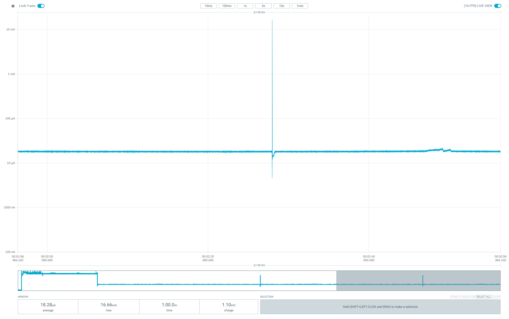

# First long run

|stats         | value               |
|--------------|---------------------|
| first boot   | 2021-10-29 17:14:54 |
| last refresh | 2021-11-08 05:39:40 |
|              |includes +1 hour due to DST|
| seq          | 131014              |
| refresh      | 859                 |
| bat          | 2998 mv             |

bat 2954 mV at 2021-11-08 11:30 ... something's draining current even when shut down

ran for 739486 seconds = 8.5 days

3.2 => 3 V took a few hours only (didn't see the 3.2 V warning display)
battery rated for 2.6Ah (9.62Wh)

=> ~12.6 mA average consumption which is x1000 more than deep sleep target (~10µA)

Assumptions without proper multi-meter measurments
* deep sleep is not measurable probably < 1 mA lets assume ~0.5mA
* each wake up takes 2s at 40mA
* each refresh takes 15s at 50mA
* each screen clear takes 30s at 50mA

* 2s wake-up is 91% of energy budget, deep sleep is 3% of energy budget
* 1s wake-up is 83% of energy budget, deep sleep is 6% of energy budget
* 0.5s wake-up is 72% of energy budget, deep sleep is 10% of energy budget

1.5s wake-up => ~2.5 Ah

First priority: save on wake-up time/energy consumption
- 40 mA is inline with measurements at https://diyi0t.com/reduce-the-esp32-power-consumption/
- Adjust CPU frequency to 80 MHz? (defaults to 240 MHz)
- Use ULP to probe temperature? https://www.youtube.com/watch?v=-QIcUTBB7Ww https://github.com/fhng/ESP32-ULP-1-Wire https://github.com/duff2013/ulptool https://github.com/espressif/arduino-esp32/issues/1491 https://github.com/platformio/platform-espressif32/issues/95 

Other TODOs:
- Use ESP-IDF logging facilities https://thingpulse.com/esp32-logging/
- Use PROGMEM https://www.e-tinkers.com/2020/05/do-you-know-arduino-progmem-demystified/


# Current measurement first soldered prototype Nov 30 2021

https://wiki.dfrobot.com/FireBeetle_Board_ESP32_E_SKU_DFR0654 see "Low Power Pad"

Measurements with UT61E+

Powered at 4V on VCC

Typical powered consumption: ~ 45 mA

With Low Power Pad not cut: ~ 490 µA

With Low Power Pad cut: ~ 71 µA / Sometimes ~125 µA ?!? / and the following day ~39 µA ?!?!?

With setup calling pinMode(2, OUTPUT or 0) and going directly to sleep and all components connected ~ 66 µA

With setup directly going to deep sleep and all components connected ~ 27 µA in deep sleep

With setup directly going to deep sleep and all components connected except DS18B20-PAR's data ping ~ 25 µA deep sleep

Board with no connections other than VCC & GND consumes ~ 14 µA in deep sleep

# Current measurement impact of light sleep during DS18B20 temp measurment

Measurements with UT61E+. The sampling and value refresh rates are a bit slow (a few 100 ms each). Values are in mA.

Wifi was disabled.

DS18B20 temperature measurement last ~750ms

DS18B20 with normal delay during measurement:


DS18B20 with light sleep during measurement:


BMP390L during measurement (no display):


# ULP coprocessor power measurements (March 2026)

Setup: FireBeetle ESP32-E with BMP390L sensor and ePaper display connected.
Measured with Nordic PPK2 on VCC. Low Power Pad cut.
Board: dfrobot_firebeetle2_esp32e, PlatformIO + Arduino framework.

## Test conditions

All measurements are 1-minute averages in steady state (excluding initial boot spike).

| Config | Sleep interval | ULP period | CPU wakes? | Avg current | Notes |
|--------|---------------|------------|------------|-------------|-------|
| Bare sleep (no init, straight to sleep) | N/A | N/A | Never | ~510 µA | No serial, sensor, or display init |
| No ULP (indefinite deep sleep) | N/A | N/A | Never | ~560 µA | Normal boot, sensor+display init, then sleep |
| ULP test (counter, no wake) | 5s ULP timer | 5s | Never | ~560 µA | ULP runs every 5s, increments counter, halts |
| ULP test (counter, no I2C) | 5s ULP timer | 5s | Every 15s (3 cycles) | — | Functional test only, not measured in steady state |
| **ULP bit-bang I2C (production)** | **5s** | **5s** | **On ≥0.1°C change** | **~562 µA** | **HULP bit-bang I2C, delta threshold=20** |

**Key findings:**
- ULP bit-bang I2C with full BMP390L temp reading: ~562 µA average deep sleep
- ULP overhead is negligible (~0 µA difference with/without ULP running)
- **With EPD VCC disconnected: ~28 µA** — essentially bare-board baseline
- **The DESPI-C02 ePaper adapter board draws ~534 µA quiescent** — this is the dominant power consumer
- ULP + RTC_PERIPH + BMP390L adds only ~1 µA above the 27 µA bare-board baseline
- Hardware RTC I2C peripheral could not be made to work (BUS_BUSY stuck, see docs/rtc-i2c-research.md)
- GPIO pin isolation (hold RST LOW, float SPI) does not reduce the DESPI-C02 draw — it's a hardware issue

## DESPI-C02 quiescent current (known hardware issue)

The ~534 µA overhead is a known issue with the DESPI-C02 adapter board. The board's boost converter
capacitors leak current even after the display controller is put into deep sleep (command 0x07).

- **Confirmed by other users**: https://github.com/ZinggJM/GxEPD2/discussions/142
  (same symptoms: ~500 µA in deep sleep, drops to ~50 µA when removing DESPI-C02 3.3V)
- **DESPI-C02 manual §4.6**: "The high current in deep sleep mode may be due to the larger
  capacitance in the boost part."
- **PPK2 trace** shows ~10ms oscillating spikes to 4-5 mA — characteristic of a boost converter
  periodically charging even in standby.
- **Software mitigations tested and ineffective**: holding RST LOW via gpio_hold_en,
  floating SPI/CS/DC pins, calling SPI.end() — none reduced the current.

### Possible fixes (all hardware)
1. **Power-gate the DESPI-C02** with a P-channel MOSFET (e.g., Si2301, AO3401) on its 3.3V line,
   controlled by a GPIO + 10kΩ pull-up. GPIO HIGH = off (sleep), GPIO LOW = on (refresh).
   FireBeetle ESP32-E has no built-in controllable 3.3V output, so this requires an external MOSFET.
2. **Replace the DESPI-C02** with direct panel wiring using the panel's spec capacitors
3. **Use a different adapter board** with better sleep characteristics

### Fix implemented: FDN340P power gate (March 2026)

P-channel MOSFET (FDN340P, SOT-23) on the DESPI-C02 3.3V line, gate driven by GPIO13/D7
with 10kΩ pull-up to 3.3V. See `docs/wiring.md` for circuit details.

- **Deep sleep with power gate: ~18 µA average** (down from ~562 µA)
- MOSFET cuts all power to DESPI-C02 during deep sleep (GPIO goes high-Z, pull-up holds gate at VCC)
- Software: `EPD_POWER_GATE` define in `local-secrets.h` enables power control in `Display.cpp`
- `epd_power_on()` drives GPIO13 LOW + 10ms delay before display init
- `epd_power_off()` drives GPIO13 HIGH after display hibernate



### Adafruit 1.54" eInk breakout — tested and rejected

The Adafruit 1.54" Tri-Color eInk breakout (ThinkInk, product #3625) was tested as an alternative.
Despite having an onboard LDO with an Enable pin, it performed **much worse**:

- **With EN floating (default):** ~3 mA average, 21 mA spikes — display controller in active state
- **With EN tied directly to GND:** ~5.5 mA average, 20 mA spikes — still drawing heavily
- Current likely back-feeds through SPI pin ESD diodes and/or microSD + SRAM components
- The board's additional components (SPI SRAM, microSD socket) create parasitic current paths
  that bypass the LDO even when disabled
- **Conclusion:** Adafruit board is ~10x worse than DESPI-C02 for deep sleep. Not suitable.

## Reference values (from earlier measurements)

- Bare board deep sleep (no connections): ~14 µA
- All components connected, setup goes straight to sleep: ~27 µA
- Previous long-run average (wake every 60s, display refresh): ~12.6 mA

## ULP bit-bang I2C implementation notes

- Uses HULP library (`hulp_i2cbb.h`) for ULP GPIO bit-bang at ~150 kHz
- BMP390L protocol: write PWR_CTRL for forced mode → 7ms delay → read 3 temp bytes
- Delta comparison on DATA_1 (middle byte), threshold=20 (~0.1°C per count)
- Compensation done on main CPU after wake using calibration data cached in RTC memory
- `hulp_peripherals_on()` sets `ESP_PD_DOMAIN_RTC_PERIPH = ESP_PD_OPTION_ON` — adds negligible current (~1 µA)

## Debug GPIO pins

- D10/GPIO17 → PPK2 D0: HIGH while main CPU is active
- D11/GPIO16 → PPK2 D1: HIGH during display refresh
- D13/GPIO12 → PPK2 D2: HIGH while ULP executing (requires `PPK2_DEBUG_ULP_GPIO` flag + RTC periph power)

Note: `PPK2_DEBUG_ULP_GPIO` forces RTC peripherals on during deep sleep, which increases sleep current. Keep disabled for accurate measurements.

## Observations

- ULP GPIO debug (D13) initially didn't show signal — fixed by removing `rtc_gpio_hold_en()` which was blocking ULP register writes
- The 562 µA with ULP bit-bang I2C is ~20x better than old wake-every-cycle (~12.6 mA) but ~20x above bare deep sleep floor (~27 µA)
- The dominant cost was the DESPI-C02 ePaper adapter board (~534 µA quiescent, known hardware issue — see section above)
- With EPD disconnected, total sleep current is ~28 µA (ULP + BMP390L + RTC_PERIPH ≈ 1 µA overhead)
- **Resolved:** FDN340P power gate on DESPI-C02 VCC brings deep sleep to ~18 µA — below bare-board baseline (pull-up likely reduces leakage paths)

# XIAO ESP32C6 power measurements (March 2026)

Setup: Seeed XIAO ESP32C6, bare board (no peripherals connected).
Measured with Nordic PPK2 on 3.3V pin (bypassing onboard LDO). Source voltage 3320 mV.
Board: seeed_xiao_esp32c6, PlatformIO + pioarduino (Arduino Core 3.x / ESP-IDF 5.x).

## Critical finding: ARDUINO_USB_CDC_ON_BOOT

The XIAO ESP32C6 board definition sets `ARDUINO_USB_CDC_ON_BOOT=1` by default, which keeps
the ESP32-C6's built-in USB Serial/JTAG controller active during deep sleep. This draws ~20 mA
constantly, completely masking deep sleep savings.

**Fix:** Add to platformio.ini env:
```ini
build_unflags = -DARDUINO_USB_CDC_ON_BOOT=1
build_flags = ... -DARDUINO_USB_CDC_ON_BOOT=0
```

Note: `-UARDUINO_USB_CDC_ON_BOOT` in build_flags alone doesn't work — PlatformIO's board
`extra_flags` are applied separately. Must use `build_unflags` to remove the board flag.

## Test results

| Config | Sleep interval | Avg current (steady state) | Deep sleep floor | Notes |
|--------|---------------|---------------------------|-----------------|-------|
| USB CDC ON (default board config) | 5s | ~20.65 mA | ~20 mA | USB Serial/JTAG stays active — unusable |
| USB CDC OFF, no WiFi, no LEDs, no display | 5s | ~415 µA | ~14 µA | Bare minimum config, DummySensor |
| USB CDC OFF, WiFi on first boot, no display | 5s | ~428 µA | ~16 µA | WiFi.disconnect(true,true) fully powers down radio |

## LP Core ULP (LP_CORE_IDLE mode, March 2026)

Setup: Bare XIAO ESP32C6, no BMP390L connected. USB CDC OFF. LP core running in idle mode
(no I2C, simulates sensor timing with 7ms delay). LP timer wakeup source. PPK2 at 3320 mV.

| Config | LP timer interval | WAKE_EVERY | HP wakes every | Deep sleep floor | Notes |
|--------|------------------|------------|----------------|-----------------|-------|
| LP_CORE_IDLE | 5s | 6 | 30s | ~15 µA | LP spikes ~1mA, HP spikes 20-50mA |

**Key findings:**
- 15 µA deep sleep baseline — LP core timer + shared memory adds negligible overhead
- LP core wakeup spikes: ~1 mA (7ms simulated sensor read time)
- HP (main CPU) wakeup spikes: 20-50 mA (DummySensor, no WiFi, no display)
- 1-minute average: ~90 µA (dominated by HP wakeups every 30s)
- In production with BMP390L I2C mode + 60s LP timer, HP wakes only on ≥0.1°C temp change

### Pending: BMP390L mode testing
- Awaiting soldering station to connect BMP390L to C6 board
- Switch `ulp/lp_core_main.c` from `#define LP_CORE_IDLE` to BMP390L I2C mode
- Verify LP I2C reads work (GPIO6=SDA, GPIO7=SCL, LP_I2C_NUM_0)
- Measure LP core power with real I2C transactions vs idle delay
- Tune TEMP_DELTA_THRESHOLD (currently 20 ≈ 0.1°C) and SLEEP_INTERVAL_S (60s for production)

## Pending: BMP58x mode testing (April 2026)

Current C6 production setup uses BMP58x (BMP581/BMP585) via LP core, not BMP390L.
Code complete; hardware validation queued.

**Context — forced-mode fix applied 2026-04-19:** `ODR_CONFIG` previously wrote `0x01`
which is `BMP5_POWERMODE_NORMAL` per Bosch's `bmp5_defs.h`, not forced. Sensor was
sampling continuously at default ODR 240 Hz between wakes (~200 µA continuous).
Now writes `0x02` (`BMP5_POWERMODE_FORCED`) — sensor runs one measurement then
auto-returns to standby. All deep-standby entry conditions now hold (deep_dis=0,
FIFO off, IIR off, ODR=0), so the sensor auto-enters deep standby (~0.5 µA)
between wakes without any extra code.

Hardware preparation:
- Solder BMP581 or BMP585 to XIAO C6 (SDA=GPIO6, SCL=GPIO7, I2C addr `0x47`)
- Switch `ulp/lp_core_main.c` from `#define LP_CORE_IDLE` to `#define LP_CORE_BMP58X`
- Set `SLEEP_INTERVAL_S=60` and `WAKE_EVERY=1` (60s LP timer, HP wake on delta only)
- Confirm `USE_BMP58x` in `local-secrets.h`

### Measurements needed to confirm full C6 operation

Baseline / correctness:
- [x] **Deep sleep floor with BMP58x connected, steady temperature.** Measured ~14 µA on 2026-04-21 (SLEEP_INTERVAL_S=5, no HP wakes in window) — matches the 15–16 µA expectation, well below the 200 µA forced-mode-broken threshold.
- [ ] **Confirm sensor is in deep standby between wakes.** Between LP core spikes, sensor contribution should be ~0.5 µA (not ~1 µA standby). If the measurement can't resolve that, alternative check: read `ODR_CONFIG` back via HP I2C right after deep-sleep exit — `pwr_mode` bits [1:0] should read `00` (standby). (Indirectly supported by the 14 µA floor, but not directly verified.)

LP core wake characterisation:
- [x] **LP core spike duration.** Measured ~3 ms on 2026-04-21 — matches the predicted 3.5–4 ms window and confirms the OSR-write removal shortened the spike vs the 7 ms LP_CORE_IDLE baseline.
- [x] **LP core spike amplitude.** Measured ~1 mA peak; stepped shape from sensor conversion not separately resolved at this zoom.
- [ ] **Charge per LP wake** (integrate current × time). Use PPK2 area measurement. Multiply by wakes/hour (3600/60 = 60) to project hourly load. (Rough estimate from spike shape: ~3 µC/wake → ~180 µC/hour ≈ 50 nA avg at 60s interval.)

HP wake characterisation:
- [ ] **HP wake duration with BMP58x** — expected shorter than DummySensor (no sensor bring-up overhead since sensor is already in deep standby). No display refresh if temp delta small.
- [ ] **Delta-wake trigger.** Heat sensor with finger; confirm HP wake fires when LP-core delta ≥25 counts (~0.1 °C). Measure HP spike shape during a real delta-triggered wake.
- [ ] **Safety-net HP wake** — confirm the periodic safety wake fires at the configured cadence (for hourly/daily bucket finalisation).

Averages:
- [ ] **1-minute average at steady state** (no delta wakes): should be ~15 µA baseline + (LP wake charge) × 1/min. Target **<30 µA**.
- [ ] **1-hour average at steady state** — dominated by 60 × LP wakes + occasional safety-net HP wake.
- [ ] **1-hour average under slow drift** (e.g., room temp drifting 1 °C/hour → ~10 delta wakes/hour) — characterises typical indoor use.

Regression checks vs prior measurements:
- [x] Compare C6 BMP58x deep sleep floor against C6 LP_CORE_IDLE floor (~15 µA). Measured 14 µA on 2026-04-21 — within 1 µA, no regression.
- [ ] Compare against ESP32-E BMP390L production (~562 µA with DESPI-C02 attached, ~28 µA without). C6 has no DESPI-C02, so C6 floor should track bare-board baseline.

PPK2 GPIO markers (reuse existing scheme from ESP32-E): tag LP-core-active and HP-active pins so the trace can be segmented automatically.

### Measured 2026-04-21 (BMP581 on XIAO C6, LP_CORE_BMP58X, SLEEP_INTERVAL_S=5)

- Deep sleep floor: **~14 µA** (PPK2 3.32 V, steady room temp, no HP wakes in window).
- LP core wake spike: **~3 ms at ~1 mA** — matches the expected 3.5–4 ms window (shorter than the 7 ms LP_CORE_IDLE baseline, as predicted after dropping the per-wake OSR write).
- Gotcha: after a warm reset (reflash or HP restart), PPK2 briefly showed extra ~200 ms spikes on top of the LP-core cadence. They **did not reappear after a full cold boot** (power cycle). Suspected leftover PMU/LP-clock state from the previous run; not investigated further since it's self-clearing.
