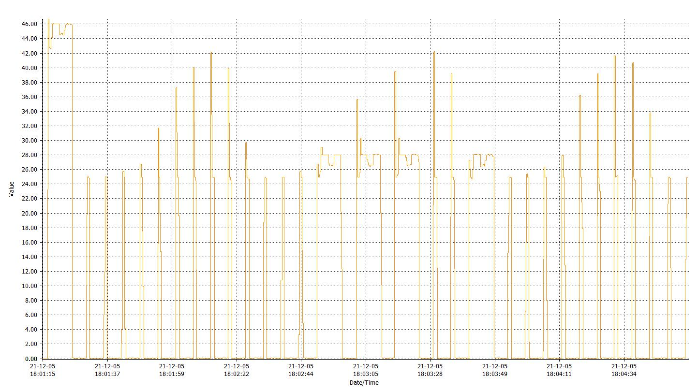
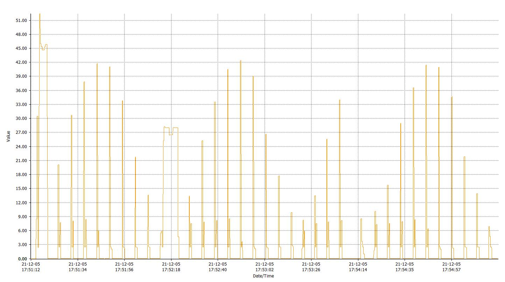
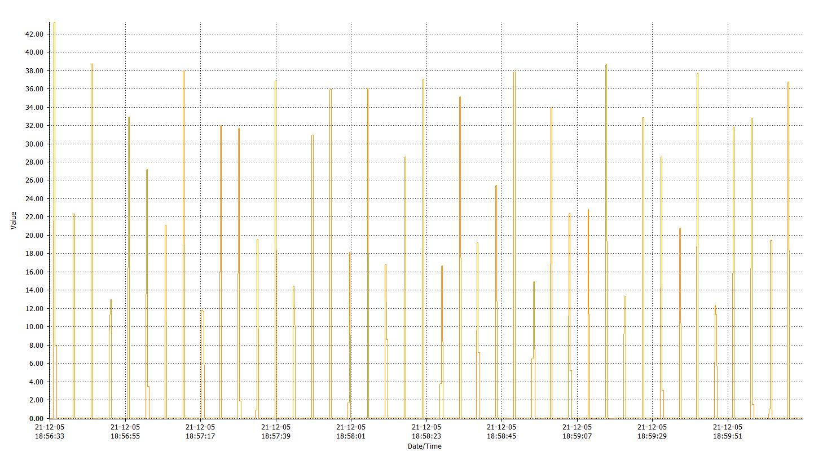

# First long run

|stats         | value               |
|--------------|---------------------|
| first boot   | 2021-10-29 17:14:54 |
| last refresh | 2021-11-08 05:39:40 |
|              |includes +1 hour due to DST|
| seq          | 131014              |
| refresh      | 859                 |
| bat          | 2998 mv             |

bat 2954 mV at 2021-11-08 11:30 ... something's draining current even when shut down

ran for 739486 seconds = 8.5 days

3.2 => 3 V took a few hours only (didn't see the 3.2 V warning display)
battery rated for 2.6Ah (9.62Wh)

=> ~12.6 mA average consumption which is x1000 more than deep sleep target (~10µA)

Assumptions without proper multi-meter measurments
* deep sleep is not measurable probably < 1 mA lets assume ~0.5mA
* each wake up takes 2s at 40mA
* each refresh takes 15s at 50mA
* each screen clear takes 30s at 50mA

* 2s wake-up is 91% of energy budget, deep sleep is 3% of energy budget
* 1s wake-up is 83% of energy budget, deep sleep is 6% of energy budget
* 0.5s wake-up is 72% of energy budget, deep sleep is 10% of energy budget

1.5s wake-up => ~2.5 Ah

First priority: save on wake-up time/energy consumption
- 40 mA is inline with measurements at https://diyi0t.com/reduce-the-esp32-power-consumption/
- Adjust CPU frequency to 80 MHz? (defaults to 240 MHz)
- Use ULP to probe temperature? https://www.youtube.com/watch?v=-QIcUTBB7Ww https://github.com/fhng/ESP32-ULP-1-Wire https://github.com/duff2013/ulptool https://github.com/espressif/arduino-esp32/issues/1491 https://github.com/platformio/platform-espressif32/issues/95 

Other TODOs:
- Use ESP-IDF logging facilities https://thingpulse.com/esp32-logging/
- Use PROGMEM https://www.e-tinkers.com/2020/05/do-you-know-arduino-progmem-demystified/

# Current measurement first soldered prototype Nov 30 2021

https://wiki.dfrobot.com/FireBeetle_Board_ESP32_E_SKU_DFR0654 see "Low Power Pad"

Measurements with UT61E+

Powered at 4V on VCC

Typical powered consumption: ~ 45 mA

With Low Power Pad not cut: ~ 490 µA

With Low Power Pad cut: ~ 71 µA / Sometimes ~125 µA ?!? / and the following day ~39 µA ?!?!?

With setup calling pinMode(2, OUTPUT or 0) and going directly to sleep and all components connected ~ 66 µA

With setup directly going to deep sleep and all components connected ~ 27 µA in deep sleep

With setup directly going to deep sleep and all components connected except DS18B20-PAR's data ping ~ 25 µA deep sleep

Board with no connections other than VCC & GND consumes ~ 14 µA in deep sleep

# Current measurement impact of light sleep during DS18B20 temp measurment

Measurements with UT61E+. The sampling and value refresh rates are a bit slow (a few 100 ms each). Values are in mA.

Wifi was disabled.

DS18B20 temperature measurement last ~750ms

DS18B20 with normal delay during measurement:

DS18B20 with light sleep during measurement:

BMP390L during measurement (no display):

# ULP coprocessor power measurements (March 2026)

Setup: FireBeetle ESP32-E with BMP390L sensor and ePaper display connected.
Measured with Nordic PPK2 on VCC. Low Power Pad cut.
Board: dfrobot_firebeetle2_esp32e, PlatformIO + Arduino framework.

## Test conditions

All measurements are 1-minute averages in steady state (excluding initial boot spike).

| Config | Sleep interval | ULP period | CPU wakes? | Avg current | Notes |
|--------|---------------|------------|------------|-------------|-------|
| Bare sleep (no init, straight to sleep) | N/A | N/A | Never | ~510 µA | No serial, sensor, or display init |
| No ULP (indefinite deep sleep) | N/A | N/A | Never | ~560 µA | Normal boot, sensor+display init, then sleep |
| ULP test (counter, no wake) | 5s ULP timer | 5s | Never | ~560 µA | ULP runs every 5s, increments counter, halts |
| ULP test (counter, no I2C) | 5s ULP timer | 5s | Every 15s (3 cycles) | — | Functional test only, not measured in steady state |
| **ULP bit-bang I2C (production)** | **5s** | **5s** | **On ≥0.1°C change** | **~562 µA** | **HULP bit-bang I2C, delta threshold=20** |

**Key findings:**
- ULP bit-bang I2C with full BMP390L temp reading: ~562 µA average deep sleep
- ULP overhead is negligible (~0 µA difference with/without ULP running)
- **With EPD VCC disconnected: ~28 µA** — essentially bare-board baseline
- **The DESPI-C02 ePaper adapter board draws ~534 µA quiescent** — this is the dominant power consumer
- ULP + RTC_PERIPH + BMP390L adds only ~1 µA above the 27 µA bare-board baseline
- Hardware RTC I2C peripheral could not be made to work (BUS_BUSY stuck, see docs/rtc-i2c-research.md)
- GPIO pin isolation (hold RST LOW, float SPI) does not reduce the DESPI-C02 draw — it's a hardware issue

## DESPI-C02 quiescent current (known hardware issue)

The ~534 µA overhead is a known issue with the DESPI-C02 adapter board. The board's boost converter
capacitors leak current even after the display controller is put into deep sleep (command 0x07).

- **Confirmed by other users**: https://github.com/ZinggJM/GxEPD2/discussions/142
  (same symptoms: ~500 µA in deep sleep, drops to ~50 µA when removing DESPI-C02 3.3V)
- **DESPI-C02 manual §4.6**: "The high current in deep sleep mode may be due to the larger
  capacitance in the boost part."
- **PPK2 trace** shows ~10ms oscillating spikes to 4-5 mA — characteristic of a boost converter
  periodically charging even in standby.
- **Software mitigations tested and ineffective**: holding RST LOW via gpio_hold_en,
  floating SPI/CS/DC pins, calling SPI.end() — none reduced the current.

### Possible fixes (all hardware)
1. **Power-gate the DESPI-C02** with a P-channel MOSFET (e.g., Si2301, AO3401) on its 3.3V line,
   controlled by a GPIO + 10kΩ pull-up. GPIO HIGH = off (sleep), GPIO LOW = on (refresh).
   FireBeetle ESP32-E has no built-in controllable 3.3V output, so this requires an external MOSFET.
2. **Replace the DESPI-C02** with direct panel wiring using the panel's spec capacitors
3. **Use a different adapter board** with better sleep characteristics

### Adafruit 1.54" eInk breakout — tested and rejected

The Adafruit 1.54" Tri-Color eInk breakout (ThinkInk, product #3625) was tested as an alternative.
Despite having an onboard LDO with an Enable pin, it performed **much worse**:

- **With EN floating (default):** ~3 mA average, 21 mA spikes — display controller in active state
- **With EN tied directly to GND:** ~5.5 mA average, 20 mA spikes — still drawing heavily
- Current likely back-feeds through SPI pin ESD diodes and/or microSD + SRAM components
- The board's additional components (SPI SRAM, microSD socket) create parasitic current paths
  that bypass the LDO even when disabled
- **Conclusion:** Adafruit board is ~10x worse than DESPI-C02 for deep sleep. Not suitable.

## Reference values (from earlier measurements)

- Bare board deep sleep (no connections): ~14 µA
- All components connected, setup goes straight to sleep: ~27 µA
- Previous long-run average (wake every 60s, display refresh): ~12.6 mA

## ULP bit-bang I2C implementation notes

- Uses HULP library (`hulp_i2cbb.h`) for ULP GPIO bit-bang at ~150 kHz
- BMP390L protocol: write PWR_CTRL for forced mode → 7ms delay → read 3 temp bytes
- Delta comparison on DATA_1 (middle byte), threshold=20 (~0.1°C per count)
- Compensation done on main CPU after wake using calibration data cached in RTC memory
- `hulp_peripherals_on()` sets `ESP_PD_DOMAIN_RTC_PERIPH = ESP_PD_OPTION_ON` — adds negligible current (~1 µA)

## Debug GPIO pins

- D10/GPIO17 → PPK2 D0: HIGH while main CPU is active
- D11/GPIO16 → PPK2 D1: HIGH during display refresh
- D13/GPIO12 → PPK2 D2: HIGH while ULP executing (requires `PPK2_DEBUG_ULP_GPIO` flag + RTC periph power)

Note: `PPK2_DEBUG_ULP_GPIO` forces RTC peripherals on during deep sleep, which increases sleep current. Keep disabled for accurate measurements.

## Observations

- ULP GPIO debug (D13) initially didn't show signal — fixed by removing `rtc_gpio_hold_en()` which was blocking ULP register writes
- The 562 µA with ULP bit-bang I2C is ~20x better than old wake-every-cycle (~12.6 mA) but ~20x above bare deep sleep floor (~27 µA)
- The dominant cost is the DESPI-C02 ePaper adapter board (~534 µA quiescent, known hardware issue — see section above)
- With EPD disconnected, total sleep current is ~28 µA (ULP + BMP390L + RTC_PERIPH ≈ 1 µA overhead)
- Fix requires hardware: power-gate DESPI-C02 with MOSFET, replace adapter, or wire panel directly
