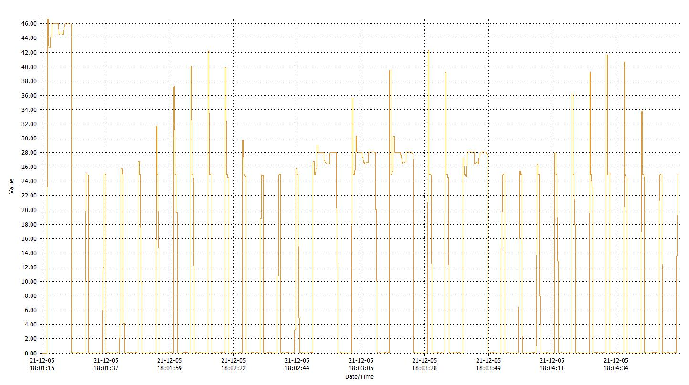
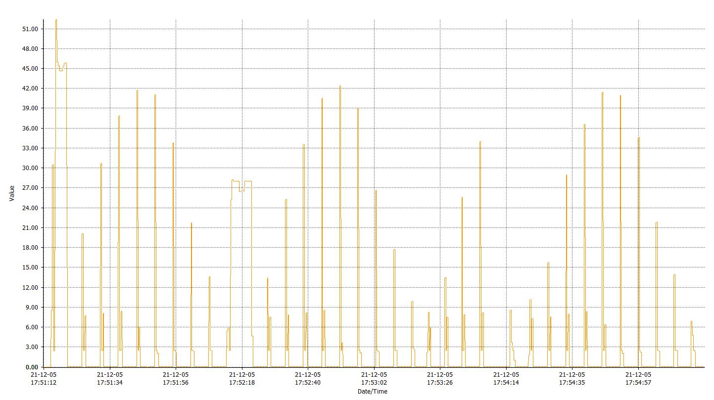
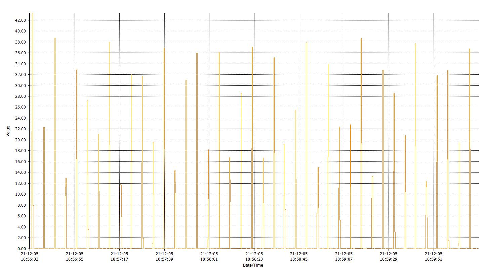
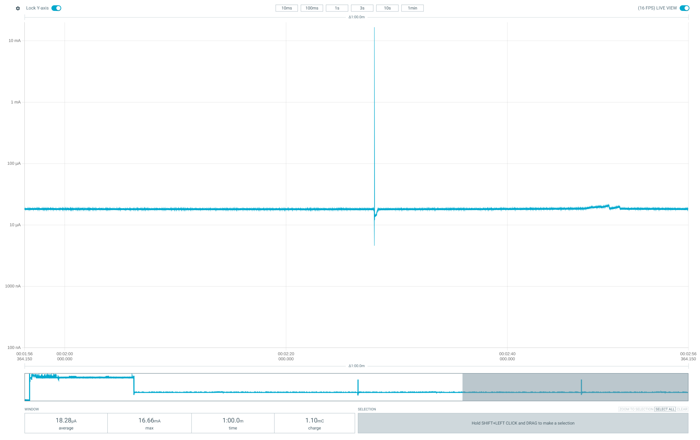

# First long run

|stats         | value               |
|--------------|---------------------|
| first boot   | 2021-10-29 17:14:54 |
| last refresh | 2021-11-08 05:39:40 |
|              |includes +1 hour due to DST|
| seq          | 131014              |
| refresh      | 859                 |
| bat          | 2998 mv             |

bat 2954 mV at 2021-11-08 11:30 ... something's draining current even when shut down

ran for 739486 seconds = 8.5 days

3.2 => 3 V took a few hours only (didn't see the 3.2 V warning display)
battery rated for 2.6Ah (9.62Wh)

=> ~12.6 mA average consumption which is x1000 more than deep sleep target (~10µA)

Assumptions without proper multi-meter measurments
* deep sleep is not measurable probably < 1 mA lets assume ~0.5mA
* each wake up takes 2s at 40mA
* each refresh takes 15s at 50mA
* each screen clear takes 30s at 50mA

* 2s wake-up is 91% of energy budget, deep sleep is 3% of energy budget
* 1s wake-up is 83% of energy budget, deep sleep is 6% of energy budget
* 0.5s wake-up is 72% of energy budget, deep sleep is 10% of energy budget

1.5s wake-up => ~2.5 Ah

First priority: save on wake-up time/energy consumption
- 40 mA is inline with measurements at https://diyi0t.com/reduce-the-esp32-power-consumption/
- Adjust CPU frequency to 80 MHz? (defaults to 240 MHz)
- Use ULP to probe temperature? https://www.youtube.com/watch?v=-QIcUTBB7Ww https://github.com/fhng/ESP32-ULP-1-Wire https://github.com/duff2013/ulptool https://github.com/espressif/arduino-esp32/issues/1491 https://github.com/platformio/platform-espressif32/issues/95 

Other TODOs:
- Use ESP-IDF logging facilities https://thingpulse.com/esp32-logging/
- Use PROGMEM https://www.e-tinkers.com/2020/05/do-you-know-arduino-progmem-demystified/


# Current measurement first soldered prototype Nov 30 2021

https://wiki.dfrobot.com/FireBeetle_Board_ESP32_E_SKU_DFR0654 see "Low Power Pad"

Measurements with UT61E+

Powered at 4V on VCC

Typical powered consumption: ~ 45 mA

With Low Power Pad not cut: ~ 490 µA

With Low Power Pad cut: ~ 71 µA / Sometimes ~125 µA ?!? / and the following day ~39 µA ?!?!?

With setup calling pinMode(2, OUTPUT or 0) and going directly to sleep and all components connected ~ 66 µA

With setup directly going to deep sleep and all components connected ~ 27 µA in deep sleep

With setup directly going to deep sleep and all components connected except DS18B20-PAR's data ping ~ 25 µA deep sleep

Board with no connections other than VCC & GND consumes ~ 14 µA in deep sleep

# Current measurement impact of light sleep during DS18B20 temp measurment

Measurements with UT61E+. The sampling and value refresh rates are a bit slow (a few 100 ms each). Values are in mA.

Wifi was disabled.

DS18B20 temperature measurement last ~750ms

DS18B20 with normal delay during measurement:


DS18B20 with light sleep during measurement:


BMP390L during measurement (no display):


# ULP coprocessor power measurements (March 2026)

Setup: FireBeetle ESP32-E with BMP390L sensor and ePaper display connected.
Measured with Nordic PPK2 on VCC. Low Power Pad cut.
Board: dfrobot_firebeetle2_esp32e, PlatformIO + Arduino framework.

## Test conditions

All measurements are 1-minute averages in steady state (excluding initial boot spike).

| Config | Sleep interval | ULP period | CPU wakes? | Avg current | Notes |
|--------|---------------|------------|------------|-------------|-------|
| Bare sleep (no init, straight to sleep) | N/A | N/A | Never | ~510 µA | No serial, sensor, or display init |
| No ULP (indefinite deep sleep) | N/A | N/A | Never | ~560 µA | Normal boot, sensor+display init, then sleep |
| ULP test (counter, no wake) | 5s ULP timer | 5s | Never | ~560 µA | ULP runs every 5s, increments counter, halts |
| ULP test (counter, no I2C) | 5s ULP timer | 5s | Every 15s (3 cycles) | — | Functional test only, not measured in steady state |
| **ULP bit-bang I2C (production)** | **5s** | **5s** | **On ≥0.1°C change** | **~562 µA** | **HULP bit-bang I2C, delta threshold=20** |

**Key findings:**
- ULP bit-bang I2C with full BMP390L temp reading: ~562 µA average deep sleep
- ULP overhead is negligible (~0 µA difference with/without ULP running)
- **With EPD VCC disconnected: ~28 µA** — essentially bare-board baseline
- **The DESPI-C02 ePaper adapter board draws ~534 µA quiescent** — this is the dominant power consumer
- ULP + RTC_PERIPH + BMP390L adds only ~1 µA above the 27 µA bare-board baseline
- Hardware RTC I2C peripheral could not be made to work (BUS_BUSY stuck, see docs/rtc-i2c-research.md)
- GPIO pin isolation (hold RST LOW, float SPI) does not reduce the DESPI-C02 draw — it's a hardware issue

## DESPI-C02 quiescent current (known hardware issue)

The ~534 µA overhead is a known issue with the DESPI-C02 adapter board. The board's boost converter
capacitors leak current even after the display controller is put into deep sleep (command 0x07).

- **Confirmed by other users**: https://github.com/ZinggJM/GxEPD2/discussions/142
  (same symptoms: ~500 µA in deep sleep, drops to ~50 µA when removing DESPI-C02 3.3V)
- **DESPI-C02 manual §4.6**: "The high current in deep sleep mode may be due to the larger
  capacitance in the boost part."
- **PPK2 trace** shows ~10ms oscillating spikes to 4-5 mA — characteristic of a boost converter
  periodically charging even in standby.
- **Software mitigations tested and ineffective**: holding RST LOW via gpio_hold_en,
  floating SPI/CS/DC pins, calling SPI.end() — none reduced the current.

### Possible fixes (all hardware)
1. **Power-gate the DESPI-C02** with a P-channel MOSFET (e.g., Si2301, AO3401) on its 3.3V line,
   controlled by a GPIO + 10kΩ pull-up. GPIO HIGH = off (sleep), GPIO LOW = on (refresh).
   FireBeetle ESP32-E has no built-in controllable 3.3V output, so this requires an external MOSFET.
2. **Replace the DESPI-C02** with direct panel wiring using the panel's spec capacitors
3. **Use a different adapter board** with better sleep characteristics

### Fix implemented: FDN340P power gate (March 2026)

P-channel MOSFET (FDN340P, SOT-23) on the DESPI-C02 3.3V line, gate driven by GPIO13/D7
with 10kΩ pull-up to 3.3V. See [`docs/wiring.md`](wiring.md) for circuit details.

- **Deep sleep with power gate: ~18 µA average** (down from ~562 µA)
- MOSFET cuts all power to DESPI-C02 during deep sleep (GPIO goes high-Z, pull-up holds gate at VCC)
- Software: `EPD_POWER_GATE` define in `local-secrets.h` enables power control in `Display.cpp`
- `epd_power_on()` drives GPIO13 LOW + 10ms delay before display init
- `epd_power_off()` drives GPIO13 HIGH after display hibernate



### Adafruit 1.54" eInk breakout — tested and rejected

The Adafruit 1.54" Tri-Color eInk breakout (ThinkInk, product #3625) was tested as an alternative.
Despite having an onboard LDO with an Enable pin, it performed **much worse**:

- **With EN floating (default):** ~3 mA average, 21 mA spikes — display controller in active state
- **With EN tied directly to GND:** ~5.5 mA average, 20 mA spikes — still drawing heavily
- Current likely back-feeds through SPI pin ESD diodes and/or microSD + SRAM components
- The board's additional components (SPI SRAM, microSD socket) create parasitic current paths
  that bypass the LDO even when disabled
- **Conclusion:** Adafruit board is ~10x worse than DESPI-C02 for deep sleep. Not suitable.

## Reference values (from earlier measurements)

- Bare board deep sleep (no connections): ~14 µA
- All components connected, setup goes straight to sleep: ~27 µA
- Previous long-run average (wake every 60s, display refresh): ~12.6 mA

## ULP bit-bang I2C implementation notes

- Uses HULP library (`hulp_i2cbb.h`) for ULP GPIO bit-bang at ~150 kHz
- BMP390L protocol: write PWR_CTRL for forced mode → 7ms delay → read 3 temp bytes
- Delta comparison on DATA_1 (middle byte), threshold=20 (~0.1°C per count)
- Compensation done on main CPU after wake using calibration data cached in RTC memory
- `hulp_peripherals_on()` sets `ESP_PD_DOMAIN_RTC_PERIPH = ESP_PD_OPTION_ON` — adds negligible current (~1 µA)

## Debug GPIO pins

- D10/GPIO17 → PPK2 D0: HIGH while main CPU is active
- D11/GPIO16 → PPK2 D1: HIGH during display refresh
- D13/GPIO12 → PPK2 D2: HIGH while ULP executing (requires `PPK2_DEBUG_ULP_GPIO` flag + RTC periph power)

Note: `PPK2_DEBUG_ULP_GPIO` forces RTC peripherals on during deep sleep, which increases sleep current. Keep disabled for accurate measurements.

## Observations

- ULP GPIO debug (D13) initially didn't show signal — fixed by removing `rtc_gpio_hold_en()` which was blocking ULP register writes
- The 562 µA with ULP bit-bang I2C is ~20x better than old wake-every-cycle (~12.6 mA) but ~20x above bare deep sleep floor (~27 µA)
- The dominant cost was the DESPI-C02 ePaper adapter board (~534 µA quiescent, known hardware issue — see section above)
- With EPD disconnected, total sleep current is ~28 µA (ULP + BMP390L + RTC_PERIPH ≈ 1 µA overhead)
- **Resolved:** FDN340P power gate on DESPI-C02 VCC brings deep sleep to ~18 µA — below bare-board baseline (pull-up likely reduces leakage paths)

# XIAO ESP32C6 power measurements (March 2026)

Setup: Seeed XIAO ESP32C6, bare board (no peripherals connected).
Measured with Nordic PPK2 on 3.3V pin (bypassing onboard LDO). Source voltage 3320 mV.
Board: seeed_xiao_esp32c6, PlatformIO + pioarduino (Arduino Core 3.x / ESP-IDF 5.x).

## Critical finding: ARDUINO_USB_CDC_ON_BOOT

The XIAO ESP32C6 board definition sets `ARDUINO_USB_CDC_ON_BOOT=1` by default, which keeps
the ESP32-C6's built-in USB Serial/JTAG controller active during deep sleep. This draws ~20 mA
constantly, completely masking deep sleep savings.

**Fix:** Add to platformio.ini env:
```ini
build_unflags = -DARDUINO_USB_CDC_ON_BOOT=1
build_flags = ... -DARDUINO_USB_CDC_ON_BOOT=0
```

Note: `-UARDUINO_USB_CDC_ON_BOOT` in build_flags alone doesn't work — PlatformIO's board
`extra_flags` are applied separately. Must use `build_unflags` to remove the board flag.

## Test results

| Config | Sleep interval | Avg current (steady state) | Deep sleep floor | Notes |
|--------|---------------|---------------------------|-----------------|-------|
| USB CDC ON (default board config) | 5s | ~20.65 mA | ~20 mA | USB Serial/JTAG stays active — unusable |
| USB CDC OFF, no WiFi, no LEDs, no display | 5s | ~415 µA | ~14 µA | Bare minimum config, DummySensor |
| USB CDC OFF, WiFi on first boot, no display | 5s | ~428 µA | ~16 µA | WiFi.disconnect(true,true) fully powers down radio |

## LP Core ULP (LP_CORE_IDLE mode, March 2026)

Setup: Bare XIAO ESP32C6, no BMP390L connected. USB CDC OFF. LP core running in idle mode
(no I2C, simulates sensor timing with 7ms delay). LP timer wakeup source. PPK2 at 3320 mV.

| Config | LP timer interval | WAKE_EVERY | HP wakes every | Deep sleep floor | Notes |
|--------|------------------|------------|----------------|-----------------|-------|
| LP_CORE_IDLE | 5s | 6 | 30s | ~15 µA | LP spikes ~1mA, HP spikes 20-50mA |

**Key findings:**
- 15 µA deep sleep baseline — LP core timer + shared memory adds negligible overhead
- LP core wakeup spikes: ~1 mA (7ms simulated sensor read time)
- HP (main CPU) wakeup spikes: 20-50 mA (DummySensor, no WiFi, no display)
- 1-minute average: ~90 µA (dominated by HP wakeups every 30s)
- In production with BMP390L I2C mode + 60s LP timer, HP wakes only on ≥0.1°C temp change

### Pending: BMP390L mode testing (never done — the C6 shipped on BMP58x)
- Awaiting soldering station to connect BMP390L to C6 board
- Switch `ulp/lp_core_main.c` from `#define LP_CORE_IDLE` to BMP390L I2C mode
- Verify LP I2C reads work (GPIO6=SDA, GPIO7=SCL, LP_I2C_NUM_0)
- Measure LP core power with real I2C transactions vs idle delay
- Tune TEMP_DELTA_THRESHOLD (currently 20 ≈ 0.1°C) and SLEEP_INTERVAL_S (60s for production)

## Pending: BMP58x mode testing (April 2026)

> **Superseded — hardware validation happened 2026-04-21** (the measured section
> at the end of this block), then again post-migration in the July sections
> below. The unticked boxes here were either answered there or absorbed into the
> 2026-07-26 budget; the ESP32-E comparison figures predate the FDN340P gate.
> Kept as the record of what was asked before the board was wired.

Current C6 production setup uses BMP58x (BMP581/BMP585) via LP core, not BMP390L.
Code complete; hardware validation queued.

**Context — forced-mode fix applied 2026-04-19:** `ODR_CONFIG` previously wrote `0x01`
which is `BMP5_POWERMODE_NORMAL` per Bosch's `bmp5_defs.h`, not forced. Sensor was
sampling continuously at default ODR 240 Hz between wakes (~200 µA continuous).
Now writes `0x02` (`BMP5_POWERMODE_FORCED`) — sensor runs one measurement then
auto-returns to standby. All deep-standby entry conditions now hold (deep_dis=0,
FIFO off, IIR off, ODR=0), so the sensor auto-enters deep standby (~0.5 µA)
between wakes without any extra code.

Hardware preparation:
- Solder BMP581 or BMP585 to XIAO C6 (SDA=GPIO6, SCL=GPIO7, I2C addr `0x47`)
- Switch `ulp/lp_core_main.c` from `#define LP_CORE_IDLE` to `#define LP_CORE_BMP58X`
- Set `SLEEP_INTERVAL_S=60` and `WAKE_EVERY=1` (60s LP timer, HP wake on delta only)
- Confirm `USE_BMP58x` in `local-secrets.h`

### Measurements needed to confirm full C6 operation

Baseline / correctness:
- [x] **Deep sleep floor with BMP58x connected, steady temperature.** Measured ~14 µA on 2026-04-21 (SLEEP_INTERVAL_S=5, no HP wakes in window) — matches the 15–16 µA expectation, well below the 200 µA forced-mode-broken threshold.
- [ ] **Confirm sensor is in deep standby between wakes.** Between LP core spikes, sensor contribution should be ~0.5 µA (not ~1 µA standby). If the measurement can't resolve that, alternative check: read `ODR_CONFIG` back via HP I2C right after deep-sleep exit — `pwr_mode` bits [1:0] should read `00` (standby). (Indirectly supported by the 14 µA floor, but not directly verified.)

LP core wake characterisation:
- [x] **LP core spike duration.** Measured ~3 ms on 2026-04-21 — matches the predicted 3.5–4 ms window and confirms the OSR-write removal shortened the spike vs the 7 ms LP_CORE_IDLE baseline.
- [x] **LP core spike amplitude.** Measured ~1 mA peak; stepped shape from sensor conversion not separately resolved at this zoom.
- [ ] **Charge per LP wake** (integrate current × time). Use PPK2 area measurement. Multiply by wakes/hour (3600/60 = 60) to project hourly load. (Rough estimate from spike shape: ~3 µC/wake → ~180 µC/hour ≈ 50 nA avg at 60s interval.)

HP wake characterisation:
- [ ] **HP wake duration with BMP58x** — expected shorter than DummySensor (no sensor bring-up overhead since sensor is already in deep standby). No display refresh if temp delta small.
- [ ] **Delta-wake trigger.** Heat sensor with finger; confirm HP wake fires when LP-core delta ≥25 counts (~0.1 °C). Measure HP spike shape during a real delta-triggered wake.
- [ ] **Safety-net HP wake** — confirm the periodic safety wake fires at the configured cadence (for hourly/daily bucket finalisation).

Averages:
- [ ] **1-minute average at steady state** (no delta wakes): should be ~15 µA baseline + (LP wake charge) × 1/min. Target **<30 µA**.
- [ ] **1-hour average at steady state** — dominated by 60 × LP wakes + occasional safety-net HP wake.
- [ ] **1-hour average under slow drift** (e.g., room temp drifting 1 °C/hour → ~10 delta wakes/hour) — characterises typical indoor use.

Regression checks vs prior measurements:
- [x] Compare C6 BMP58x deep sleep floor against C6 LP_CORE_IDLE floor (~15 µA). Measured 14 µA on 2026-04-21 — within 1 µA, no regression.
- [ ] Compare against ESP32-E BMP390L production (~562 µA with DESPI-C02 attached, ~28 µA without). C6 has no DESPI-C02, so C6 floor should track bare-board baseline.

PPK2 GPIO markers (reuse existing scheme from ESP32-E): tag LP-core-active and HP-active pins so the trace can be segmented automatically.

### Measured 2026-04-21 (BMP581 on XIAO C6, LP_CORE_BMP58X, SLEEP_INTERVAL_S=5)

Setup: XIAO ESP32-C6 + BMP581 (I2C on GPIO6/7, addr 0x47) + GDEH0576T81 e-paper, `seeed_xiao_esp32c6_release` env (USB CDC off, DISABLE_SERIAL). PPK2 at 3.32 V.

- Deep sleep floor: **~14 µA** (steady room temp, no HP wakes in window).
- LP core wake spike: **~3 ms at ~1 mA** (see `docs/xiao-seeed-esp32c6-bmp581-deep-sleep-i2c-lp-core-read.png`) — matches the expected 3.5–4 ms window (shorter than the 7 ms LP_CORE_IDLE baseline, as predicted after dropping the per-wake OSR write).
- Screen refresh (GDEH0576T81 full update): **~3.2 s at ~29 mA avg, ~322 mA peak, ~93 mC charge** per refresh (see `docs/xiao-seeed-esp32c6-bmp581-GDEH0576T81-screen-refresh.png`). Dominates the energy budget whenever it fires — at one refresh/hour this alone averages to ~26 µA.
- Gotcha: after a warm reset (reflash or HP restart), PPK2 briefly showed extra ~200 ms spikes on top of the LP-core cadence. They **did not reappear after a full cold boot** (power cycle). Suspected leftover PMU/LP-clock state from the previous run; not investigated further since it's self-clearing.


# Post-espidf-migration power measurements (July 2026, IDF 6.0.1, PPK2)

All figures are config-specific — panel + sensor + board matter.

## XIAO ESP32-C6 + BMP581 + GDEH0576T81 (920x680), release build

- Deep sleep: **15.5-16 µA** (Arduino-era baseline ~15 µA — parity).
  USB-Serial-JTAG console (CONFIG_ESP_CONSOLE_USB_SERIAL_JTAG) confirmed
  harmless in deep sleep; the Arduino-era ARDUINO_USB_CDC_ON_BOOT ~20 mA
  gotcha no longer exists.
- Temp-refresh wake (render + SPI push + full panel refresh): **3.2 s,
  ~95 mC** per event (Arduino-era: 3.2 s, ~93 mC — parity). At one
  refresh/hour this event alone averages ~26 µA, dominating the budget.
- Trace shape: ~1.5 s flat ~35 mA (boot + render + SPI push), then panel
  waveform bursts (~465 mA peak observed).

## FireBeetle 2 ESP32-E + BMP390L + GDEH0154Z90 (200x200 3-color), release build

- Deep sleep with FDN340P gate + ULP FSM polling: **19-20 µA** (Arduino-era
  ~18 µA on the same rig — parity within measurement variance).
- Z90 full refresh exceeds GxEPD2's hardcoded 20 s busy timeout → benign
  "Busy Timeout!" print every refresh (pre-existing; the print is ungated
  by the diag flag). Each refresh keeps the CPU awake the full ~21 s on
  this panel — refresh-rate limiting matters most here.

## Light sleep during EPD busy-wait (added after the above measurements)

- GxEPD2 setBusyCallback → esp_light_sleep_start() with GPIO wake on BUSY
  (level-agnostic) + 500 ms timer backstop; wake sources fully disarmed
  after each slice so nothing leaks into deep sleep.
- Needed three companions to work at all: gpio_sleep_sel_dis on
  CS/DC/RST/SCK/MOSI **and the EPD power-gate pin** (pins otherwise switch to
  their sleep config each slice — panel saw RST/power glitches: symptom was
  a started refresh ending in faint noise), plus keeping the C6's TOP power
  domain ON during slices (GPSPI register state), restored to AUTO after.
- **Measured (C6/GDEH0576T81, release): 95.4 → 56.25 mC per refresh event,
  −41%** — better than the ~27% estimate because light sleep covers the
  power-on/off busy waits too. Event wall-time 3.2→~3.8 s (backstop
  granularity; energy is what matters). Deep sleep unaffected (~15.5 µA).
  Evidence: xiao-seeed-esp32c6-bmp581-GDEH0576T81-screen-refresh-light-sleep.png
  vs the pre-light-sleep xiao-seeed-esp32c6-bmp581-GDEH0576T81-screen-refresh.png
  (Arduino-era-equivalent, ~93-95 mC).
- At 1 refresh/hour: refresh contribution ~26.5 → ~15.6 µA; total average
  ~42 → ~31 µA. Now ~40% below the Arduino-era firmware on this metric.
- **Measured (ESP32-E/GDEH0154Z90, release): 600 → 139 mC per refresh event,
  −77%** — the Z90's ~21 s busy window went from a solid ~24 mA spin-wait band
  to ~6.4 mA average (≈40 mC active phase: boot + ULP read + render + push;
  ≈100 mC panel drive + light-sleep floor). At 1 refresh/hour the refresh
  contribution drops ~167 → ~39 µA; total rig average ~186 → ~58 µA ≈ 3×
  battery life at that cadence. Evidence:
  firebeetle2-esp32e-bmp390l-GDEH0154Z90-screen-refresh.png (before) /
  -light-sleep.png (after). Savings scale with busy duration — slow panels
  gain most; tiny/fast panels gain less.
- Backstop raised 100→500 ms after the measurements above (free
  latency-wise — the GPIO level wake ends each wait instantly):
  **confirmed ~129 mC/event on the Z90 rig** (down from 139 at 100 ms),
  negligible difference expected on the C6.

## ULP wake latch — refresh trains (July 2026)

Symptom (PPK2, E/Z90 release): bursts of ~3 back-to-back refresh events with
~2 s gaps, then a clean 60 s sleep, repeating. Cause: the ULP FSM programs
called I_WAKE unconditionally; a wake signalled while the host was still awake
(Z90 renders ~21 s, easily overlapping a 60 s poll) latches in RTC_CNTL and
fires the moment deep sleep is entered. Pre-existing (same trains visible in
Arduino-era-equivalent debug logs); NOT caused by the light-sleep change.

Fix: gate I_WAKE on RTC_CNTL_RDY_FOR_WAKEUP and skip without updating the
delta reference — the delta re-detects at the next poll, so wakes happen at
most once per poll interval.

Verified on hardware (E/Z90 release, PPK2): single refresh per wake episode,
wakes correctly spaced at the 60 s poll cadence from the end of the previous
refresh, no cold-boot phantom refresh. Sibling fixes from the same episode:
ULP delta reference seeded on first run (cold boots used to double-refresh,
masked pre-gating by the wake latch), ULP program size now checked at BUILD
time (scripts/check_ulp_size.py, exact — validated 127/128 == on-device count,
and proven to fail the build on the old 129-word regression) with a graceful
runtime fallback (log + safety-net wakes) instead of an abort loop.

Open: the C6 LP-core program (ulp/lp_core_bmp58x.h) has the same unconditional
ulp_lp_core_wakeup_main_processor() calls, but the 5.76" rig is only awake
~3.8 s per cycle (~6% collision chance at 60 s polls). Gating needs a PMU
HP-sleep-state check from LP-core C code — do if trains are ever observed on
the C6.

## Skip app image validation on deep-sleep wake (July 2026)

`CONFIG_BOOTLOADER_SKIP_VALIDATE_IN_DEEP_SLEEP=y` (sdkconfig.defaults, both
boards): the 2nd-stage bootloader no longer re-hashes the ~1MB app image over
DIO/40MHz flash on every deep-sleep wake — that SHA256 pass recurred on 100%
of wakes, including no-refresh safety-net wakes. Power-on/reset boots still
validate. Uses the bootloader RTC-FAST retain area (16 bytes); ULP +
RTC_DATA_ATTR live in RTC slow memory, layout unchanged (overlap check OK).

- **Measured (ESP32-E/GDEH0154Z90, release, confirmed on 2 wakes):**
  - Active phase (boot + ULP read + render + push, before panel drive):
    **~40 → 22.5 mC** — 710 ms at ~32 mA avg (was ~1.7 s). The skipped
    validation was ~1 s of wall time, more than the ~250-400 ms estimate.
  - Full refresh event: **~129 → 114.5 mC** (19.0 s at 6.01 mA avg).
  - Evidence: firebeetle2-esp32e-bmp390l-GDEH0154Z90-wake-active-phase-skip-validate.png,
    firebeetle2-esp32e-bmp390l-GDEH0154Z90-screen-refresh-skip-validate.png.
- Deep-sleep floor re-confirmed with the retain area powered: **~19.4 µA**
  (within the pre-change 19-20 µA) — the sub-µA expectation held.
- C6 re-measured below (see "C6 measurements" section).

## Flash QIO/80MHz — tried and reverted (July 2026)

With deep-sleep image validation skipped, flash speed no longer matters:
QIO/80MHz (vs the board-default DIO/40MHz) shrank the active phase by only
~13 ms (710.5 → 697.3 ms) while raising its average draw ~4.4 mA
(31.7 → 36.1 mA) — net **22.5 → 25.2 mC, WORSE**. Full refresh event ~116 mC
(vs 114.5). Faster flash clocking costs current across the whole window; the
post-skip-validate active phase is CPU-bound, not flash-read-bound. Reverted
to DIO/40MHz. (Would have been the wrong experiment order pre-Stage-1: with
the ~1 s SHA256 pass still present, QIO would likely have won.)

## Compile at -Os (July 2026)

IDF builds default to -Og regardless of PlatformIO's build_type=release —
verified via compile_commands.json: all 908 app TUs were -Og. Now
`CONFIG_COMPILER_OPTIMIZATION_SIZE=y` in sdkconfig.defaults (both boards,
debug envs too — they exist for serial logs, not JTAG stepping).

- **Measured (ESP32-E/GDEH0154Z90, release):** active phase
  **22.5 → 20.6 mC** (710 → 640 ms at ~32 mA); full refresh event
  **114.5 → 112 mC**. Binary 1014 → 938 KB (also speeds any future
  power-on validation).
- Zoomed active-phase trace (1 s window): ~90 ms ROM+bootloader, one-sample
  ~405 mA spike at EPD power-gate turn-on (boost inrush), then a flat
  ~33 mA band to ~620 ms (IDF bring-up + render + SPI push ≈ 12.5 mC —
  the bulk of what's left), then panel drive takes over.
- Evidence: firebeetle2-esp32e-bmp390l-GDEH0154Z90-wake-active-phase-Os.png,
  firebeetle2-esp32e-bmp390l-GDEH0154Z90-screen-refresh-Os.png.
- Running total for the day (E/Z90 rig, per refresh event):
  600 mC (spin-wait era) → 129 (busy-wait light sleep) → 114.5 (skip
  validation) → **112 mC**; pre-refresh active phase 40 → 22.5 → **20.6 mC**.

## C6 measurements: skip-validate + -Os combined (July 2026)

Same two changes measured together on the XIAO C6 + BMP581 + GDEH0576T81
rig (release; the two effects were only separated on the ESP32-E above):

- Active phase (boot + render + SPI push): **28.5 → 18.3 mC**
  (1.08 s @ 26.4 mA → 0.80 s @ 22.9 mA).
- Full refresh event: **56.25 → 45.3 mC** (−19%). At 1 refresh/hour the
  refresh contribution drops ~15.6 → ~12.6 µA.
- Binary 1080 → 983 KB.
- Evidence: xiao-seeed-esp32c6-bmp581-GDEH0576T81-wake-active-phase-pre-skip-validate.png
  (before) / -wake-active-phase-skip-validate-Os.png /
  -screen-refresh-skip-validate-Os.png (after).
- Deep-sleep floors re-confirmed with the skip-validate retain area powered:
  **~15.8 µA C6, ~19.4 µA E** — both within their pre-change ranges
  (15.5-16 / 19-20 µA); no measurable floor cost.
- Bench gotcha from this session: a wrong screen/sensor local-secrets.h
  config panic-looped at ~600 ms cadence and read as a "~670 µA floor with
  25 mA pings" — the e-paper retaining a stale frame (old GIT_HASH + time
  on screen) was the tell that no boot ever reached render.

## Seeed XIAO ePaper Driver Board, first measurements (2026-07-05)

XIAO C6 + BMP581 + Seeed ePaper Driver Board (fixed RESE 0.47Ω, no power
gate) + GDEW029I6FD (2.9" 296x128), release build,
`seeed_xiao_esp32c6_epaper_release`. PPK2 source-meter 3.3 V into the 3V3
rail — the ETA9740 battery path is UNPOWERED in this setup (5V rail dead),
so these numbers exclude it.

- Deep-sleep floor: **~25.1 µA** avg (24.5–26 µA band). vs the 15.8 µA
  DESPI-gated baseline that's **+~9.3 µA for the ungated shield standby**
  (booster + hibernated panel + FPC) — nothing like the DESPI-C02's ~534 µA
  ungated, so a power-gate mod is likely not worth it here
  (+9.3 µA ≈ 0.8 C/day; one refresh/hour ≈ 3.4 µA-equivalent at this panel).
- Full refresh event: **12.21 mC over 3.57 s**, 43.3 mA peak. First I6FD
  datapoint — panel-specific, not comparable to the T81's 45.3 mC.
- The ±0.7 µA fuzz on the floor at 100 ksps is normal PPK2 low-range noise,
  not a wiring problem; the average is the meaningful number.
- Evidence: xiao-seeed-esp32c6-seeed-epd-board-GDEW029I6FD-screen-refresh.png
  / -deep-sleep-floor.png / -1min-overview.png.
- Still open at the time: ETA9740 quiescent via the JST battery path, ETA9740
  leakage when battery-direct on the XIAO BAT pads. Both measured the same day —
  the two subsections below.

### Battery path via shield JST (ETA9740) — measured, ruled out (2026-07-05)

Same rig, PPK2 as battery into the shield's JST (source-meter at 3.3 V,
confirmed; a second run at 4.2 V follows below).

- Floor: **~499 µA average** (settling from ~900 µA after plug-in) vs 25.1 µA
  on the 3V3 rail — ~20× the whole rest of the system; would drain the
  400 mAh pouch in ~a month at idle. The DESPI-C02's ~534 µA problem,
  relocated to the battery side.
- Signature: 20–83 mA pulses every ~2 s (ETA9740 load-detect/boost-refresh —
  the sleeping system sits below its load threshold, so it pulses forever)
  over continuous mA-scale pulse-skipping fuzz.
- Refresh at the battery node: **17.13 mC / 3.24 s** vs 12.21 mC at the rail.
  At 3.3 V: 56.5 mJ vs 40.3 mJ; net of ~5.3 mJ ETA9740 idle in the window,
  double conversion (boost→5 V→XIAO LDO) is ~75–80% efficient — fine, and
  irrelevant next to the idle draw.
- Verdict: **JST/ETA9740 path is a non-starter for deployment** — go battery
  direct on the XIAO BAT pads. Decisive remaining measurement: ETA9740
  leakage in that config (JST empty, switch off).
- Evidence:
  xiao-seeed-esp32c6-seeed-epd-board-GDEW029I6FD-eta9740-battery-path-floor.png
  / -eta9740-battery-path-refresh.png.

Second run at 4.2 V (full-charge voltage):

- Floor: ~483 µA avg over the first minute, settling to **~327 µA** in the
  second. The settling is the ETA9740 relaxing after plug-in (900 µA at
  connect → dense pulse-skipping fuzz band → fuzz stops ~t+65 s leaving only
  discrete load-detect bursts every ~2-5 s, some with ~100 mA restart
  inrush). The transition roughly coincides with the first LP-core wake
  (~60 s) but is almost certainly the IC's own standby transition — a µA/ms
  LP read can't lower the boost duty. Even settled: ~7.9 mAh/day, verdict
  unchanged.
- Wake+refresh: **12.31 mC / 3.34 s at 4.2 V = 51.7 mJ** vs 40.3 mJ at the
  3.3 V rail → ~78% double-conversion efficiency, consistent with the 3.3 V
  battery run. The mC figure matching the rail's 12.21 mC is the higher
  voltage compensating — compare in mJ.
- Evidence: xiao-seeed-esp32c6-seeed-epd-board-GDEW029I6FD-eta9740-4V2-settling.png
  / -eta9740-4V2-settled-floor.png / -eta9740-4V2-refresh.png.

### Battery direct on XIAO BAT pads — voltage sweep (2026-07-05)

Same rig, PPK2 as battery on the XIAO's underside BAT pads (shield JST
empty, switch off). Key fact from the XIAO C6 v1.0 schematic
(`hardware/XIAO ESP32-C6 v1.0 SCH.pdf`): the 3.3 V rail is a **SGM6029C
synchronous buck** (0.47 µH), NOT an LDO — VBAT feeds it through a P-FET
power path (LP0404N3), VBUS through a Schottky; charger is a separate
SGM40567-4.2 (120 mA). A pure buck making 3.3 V from a Li-ion explains the
strong voltage dependence:

| VBAT | settled floor | input power | signature |
|------|--------------|-------------|-----------|
| 4.2 V | 22.0 µA | 92.4 µW | clean PFM, sparse 2-8 mA narrow spikes |
| 3.8 V | 24.3 µA | 92.3 µW | clean, same character |
| 3.5 V | "10.75 µA" | 37.6 µW (!) | quiet sag phase, then burst storm to 0.88 A |
| 3.3 V | 121 µA | 400 µW | continuous ~30 Hz sawtooth bursts to 480 µA |

- ≥3.8 V: healthy. Input power constant at ~92 µW vs 82.9 µW at the rail →
  **~90% buck efficiency at a 25 µA load**; battery current is LOWER than
  rail current (the switcher giveaway).
- 3.3 V: buck in dropout — ~100% duty with periodic high-side
  bootstrap-refresh bursts (sag → 480 µA burst → decay, ~30 Hz), ~5× floor.
- 3.5 V: same sag/refresh cycle stretched to ~a minute. The 10.75 µA quiet
  phase is BELOW the sleeping system's output power — steady-state
  impossible, so the 3V3 rail must be sagging (system coasting on output
  caps / degraded); the 0.88 A bursts are current-limit recovery, likely
  with brownout restarts if a wake lands there. UNVERIFIED detail: probe
  the 3V3 rail (or check display/serial alive) during the quiet phase.
- Deployment: **battery-direct is the config — 22 µA/92 µW floor — but the
  usable window ends ~3.6-3.7 V**. Below that: dropout pathology, and
  0.88 A bursts into a weak battery's ESR likely boot-loop during refreshes.
  Cost of a 3.6 V shutdown is SMALL at our drain: at µA load (C/18000
  floor, ~0.11C refresh peaks, ~10-20 mV sag) VBAT rides the OCV curve,
  and standard LCO LiPo OCV stays ≥3.6 V until ~5-8% SoC — so we abandon
  only ~20-30 mAh of the 400 mAh pack (~4-7% in energy; ~3-6 weeks of a
  ~1.5 yr load-only life, comparable to what self-discharge would have
  eaten anyway). Chemistry-generic for 3.7 V LiPo; would NOT hold for
  LiFePO4 (3.2 V nominal — whole curve below the buck's cliff, unusable).
  Caveat: cold raises ESR several-fold — sample VBAT during sleep, not
  mid-refresh, or a 45 mA refresh at ~0°C sags below threshold early.
- Reproducibility: the 3.5 V sag state (10.75 µA quiet phase + burst storm)
  reproduced twice — deterministic mode-boundary behavior, not a glitch.
  Exact edge between 3.5 V (bad) and 3.8 V (clean) unmeasured; bisect at
  ~3.65 V to place the firmware shutdown threshold just above it.

Fine sweep (same evening) — full regime map, input-power lens (I×VIN):

| VIN | floor | input power | regime |
|-----|-------|-------------|--------|
| 4.2 | 22.0 µA | 92 µW | healthy PSM |
| 3.9 | 22.9 µA | 89 µW | healthy PSM |
| 3.8 | 24.3 µA | 92 µW | healthy PSM |
| 3.7 | 22.9 µA | 85 µW | healthy PSM — lowest verified-good point |
| 3.6 | 19.2 µA | 69 µW | SAG band: quiet + recovery storms to 0.53 A |
| 3.5 | 10.75 µA | 38 µW | deep sag + 0.88 A storms (2× repro) |
| 3.4 | 26.2 µA | 89 µW | continuous-burst dropout: dense 5-13 mA µs-spikes, rail held, functional |
| 3.3 | 121 µA | 400 µW | 30 Hz sag/burst sawtooth, system alive |
| 3.2 | 304 µA | 970 µW | 0.54 A boot-loop on entry, then system dead; flat converter churn (max 320 µA, no LP spikes) |

Physics: the SGM6029's NMOS high-side needs a bootstrap cap that only
recharges when the low-side switches. Near VIN≈VOUT the hysteretic mode
logic decides it barely needs to switch — starving the bootstrap; the
high-side degenerates to a source follower (VOUT ≈ VIN − VTH ≈ sag to
~2.9-3.1 V). A sagged rail LOWERS the sleeping load (leakage falls with
VDD), which is why sag-band input power reads BELOW healthy — the load is
being starved, not saved. Deep sleep tolerates it; any wake demanding tens
of mA collapses the follower → brownout → restart storms at the current
limit (di/dt ≈ VIN/0.47 µH ≈ 7 A/µs → cycle-by-cycle 0.5-0.9 A combs).
At 3.4 V duty demand (97%) forces continuous bursting — every burst
refreshes the bootstrap, so it's loud but healthy (89 µW). At ≤3.3 V
conversion is impossible and the sag/burst cycle runs continuously.
Non-monotonic vs VIN because each step lands in a different limb of the
hysteretic "do I need to switch?" state machine.

Consequence: 3.6 V is INSIDE the sag band → C6 shutdown threshold raised
3650 → 3700 mV (lowest verified-healthy), warn 3750 → 3800 mV. Costs
~12-15% of capacity by OCV instead of 5-8% — the real price of the pure
buck. Evidence: xiao-c6-bat-pads-3V7-clean-floor.png, -3V9-floor-after-
boot.png, -3V6-sag-with-storm.png, -3V4-continuous-burst.png,
-3V2-bootloop-then-dead.png (plus earlier 4V2/3V8/3V5/3V3 shots).

10 mV bisect of the sag edge (2026-07-05, short captures, floors stable):
3.51 V = 7.98 µA, 3.52 V = 6.89 µA, 3.53 V = 7.91 µA, 3.54 V = 8.07 µA
(all ~24-29 µW deep sag), 3.55 V = 25.13 µA (89 µW, regulating). The
deep-sag/regulating transition is a razor-sharp comparator threshold at
**3.545 ± 0.005 V ≈ VOUT + 245 mV** — the SGM6029's "VIN close to VOUT"
mode detector. 3.55 V still showed one storm in a minute and 3.6 V dwells
intermittently sagged (69 µW), so ~3.55-3.65 V is a bistable hysteresis
band — 3700 mV shutdown stands.
- SGM6029 datasheet vs reality: spec advertises "100% Duty Cycle Operation
  Capability" (high-side held on as battery approaches/falls below VOUT,
  VIN range 1.95-5.5 V, UVLO ~1.9 V) — no VIN>VOUT margin requirement
  stated. Measured behavior at the mode boundary is far less graceful than
  the prose. 3.8 V appears in the datasheet only as a typical-plot test
  condition, not a recommended minimum. Iq spec 2.3 µA (not switching) /
  ~8.5 µA (switching, PSM) brackets the measured floors.
- Firmware gap: C6 `read_battery_level()` is stubbed (returns 4321) and
  low/no-battery thresholds (3200/3000 mV) sit below where the hardware
  already misbehaves — needs a real VBAT read + a shutdown threshold above the
  cliff. **Thresholds done** (3800/3700 mV, `431ea30`); the stub is what
  survives. No *header* pin is left for a divider with the shield fitted, but
  the underside MTMS/MTDI pads are ADC-capable and free — `docs/wiring.md`.
- ETA9740 leakage in this config: none observed — the 22 µA @ 4.2 V floor
  with the shield attached matches the rail baseline within buck efficiency.
- Evidence: xiao-c6-bat-pads-4V2-floor(-zoom).png, -3V8-floor.png,
  -3V5-sag-and-burst-storm.png, -3V3-dropout-sawtooth(-zoom).png.

## Flash history archive: base snapshot cost (2026-07-25, ESP32-E)

FireBeetle 2 ESP32-E + BMP390L + GDEH0154Z90, PPK2 source-meter **3300 mV**,
`dfrobot_firebeetle2_esp32e_debug` built with
`-DPPK2_DEBUG -DHISTORY_BASE_EVERY_WAKE` (forces one snapshot per wake, which
is the only way to catch one — normal cadence is ~1/day). Measured on a
non-refresh wake, so no EPD current is involved; `epd_power_off()` has already
gated the panel rail by the time this runs anyway.

**Take the capture, then flash the build back out.** Forcing the snapshot moves
the write rate off the wall clock and onto the wake rate, which is the one thing
the archive's endurance margin depends on. Left running — worst case parked in
the USB service window at a 5s interval — that is ~8,600 erases per base slot
per day against the usual 100k-cycle NOR figure, so a slot is spent in under a
fortnight. Derived from the layout, not measured, and the flash part is not
identified in this repo; normal operation sits four orders of magnitude away.

The write is bracketed on D1 by a 3x50ms preamble, so it can be found zoomed
out and selected exactly.

| | measured |
|---|---|
| duration | **170.2 ms** |
| average current | **41.94 mA** (46.83 mA peak) |
| **charge** | **7.14 mC** (23.6 mJ at 3.3 V) |
| baseline during preamble | ~29 mA |

So the flash operation itself adds **~13 mA** over simply being awake: 2.2 mC
is flash, 4.9 mC is the 170 ms of awake time it forces. There is no way to
avoid the latter — the write requires the CPU up with the cache disabled.

On-device timing of the flash calls alone (`ms_now()` either side) reads
erase 104-125 ms, program 25 ms, verify 7-8 ms. The ~13 ms the marker sees on
top is the CRC32 pass over the 6.4 KB payload plus the malloc/memcpy, which sit
inside the bracket but outside the timed calls.

Erase time drifted 104 -> 117 -> 125 ms over ~75 snapshots on the same two
ping-ponged sectors. Probably temperature or noise rather than wear at ~37
cycles per sector, but it is a 20% spread on the dominant term and worth
re-checking if it keeps climbing.

**Cadence implications**, against the ~7.1 C/day budget for this rig
(1.68 C floor + ~48 refreshes at 112 mC):

| base snapshot cadence | cost | share of budget |
|---|---|---|
| ~1/day (current) | 7.1 mC/day | **0.1%** |
| hourly | 171 mC/day | 2.4% |
| every wake (~72/day) | 514 mC/day | 7.2% |

The current cadence is free. Going hourly to keep the 24h sparkline no more
than an hour stale after a reflash would cost 2.4% — affordable but not
obviously worth it, since the sparkline rolls over daily anyway.

Journal appends (one 16-byte page program per hour) are not separately
resolvable and were not chased: ~1 ms against a 170 ms snapshot.

### Can the base snapshot overlap other work? No (considered 2026-07-25)

4.9 mC of the 7.14 mC is just awake time, so overlapping it with something the
CPU is doing anyway looks attractive. It doesn't work:

- **No parallelism exists.** `esp_flash_erase/write` disable the cache and
  busy-poll the status register, so the CPU cannot execute cached code while
  they run. IDF has no async/DMA flash API. The write blocks by construction.
- **The EPD busy-wait is the worst candidate, not the best.**
  `epd_busy_light_sleep()` calls `esp_light_sleep_start()` — the chip is halted
  at ~1-2 mA, which is why a ~20 s Z90 refresh averages only ~5.6 mA. Writing
  flash there means staying awake instead: ~27 mA x 170 ms = ~4.7 mC added
  against ~4.9 mC saved. Net zero, and `epd_pin_sleep_hold()` exists because the
  panel aborts its waveform if the control lines glitch mid-refresh — a
  cache-disabled 125 ms erase in the middle of that is a corrupted frame
  waiting to happen.
- The SNTP wait is the only genuinely idle-awake window, but the ordering is
  wrong: the snapshot has to capture the drift block the resync produces.

The lever that does exist is **duration**, dominated by erasing two sectors
(104-125 ms of 170). The payload is 6388 B, just over one 4 KB sector. Dropping
the hourly ring (4320 B) from the base leaves ~2 KB, so one sector:
erase ~53 ms, total ~76 ms, **~3.2 mC — a 55% cut**.

Not done, because at ~1 snapshot/day this saves 4 mC/day out of ~7.1 C/day and
costs: restore would have to walk the journal backwards across base generations
to rebuild the 720-hour ring (the `base_seq` filter that makes replay trivial
only works forwards), and the base would no longer be able to restore 30 days
on its own if the journal were damaged. Revisit only if the cadence goes hourly.

## C6 ePaper rig: measured budget (2026-07-26)

Rig: XIAO ESP32-C6 + BMP581 + Seeed ePaper driver board (GDEW029I6FD), PPK2 source
meter at **4.2 V on the XIAO's soldered BAT pads**, `91f08eb` production build
(`seeed_xiao_esp32c6_epaper_release`, no `PPK2_DEBUG`). Analysed with
`tools/ppk2.py`. Supersedes the earlier projection that scaled the FireBeetle
numbers across; every term below except one is now measured on this rig.

| Term | C/day | Share | Basis |
|---|---|---|---|
| Sleep floor, 21.7 µA | 1.875 | **86%** | measured, flat over 21 min |
| Refresh wakes, 10.7/day × 10.05 mC | 0.107 | 4.9% | both measured |
| NTP resync, 117 mC / 1.54 d | 0.076 | 3.5% | both measured |
| Non-refresh wakes, 20/day × ~2.5 mC | 0.051 | 2.3% | rate measured, **charge estimated** |
| Post-wake transient, 0.26 mC × 31/day | 0.008 | 0.4% | measured |
| **Total** | **2.12** | | **~680 days** on a 400 mAh pack |

### The figures

- **Sleep floor: 21.7 µA.** Verified two ways on a 30-minute capture — an explicit
  1200 s `--from/--to` window integrates to 21.72 µA, and 60 s profile bins hold
  21.5-22.1 µA across 21 consecutive minutes. Half a deployment sleep interval
  (field rate: one wake per ~46 min), dead flat, no creep.
- **Wake + refresh: 10.05 mC** over 3.25 s. Four production observations (9.62,
  9.53, 10.43, 10.62), ±6%.
- **Panel refresh alone: ~8.3 mC** over ~3.03-3.06 s, five observations spanning
  7.56-9.23 mC (±10%). Separable only on a `PPK2_DEBUG` build, where the D1 marker
  brackets it; the balance of the wake is ~5 mC of overhead. The older 12.21 and
  12.31 mC "refresh" figures for this panel were wake+refresh, not the panel.
- **Successful NTP resync: ~117 mC** over 1.8 s. Two independent acquisition paths
  6% apart (113.4 mC live via `ppk2-api`, 120.7 mC from an nRF app CSV export).
  2-3× cheaper than the 200-400 mC that was projected. Shape: radio on with a
  198 mA spike (PA/calibration inrush), 70-80 mA sustained for 1.3 s, two short TX
  bursts for SNTP and teardown.
- **Post-wake transient: ~0.26 mC per wake.** Wake-triggered, peaks ~20 s in, decays
  over 35-60 s, then flat. Negligible in deployment (0.4%) but ~40% duty on a bench
  where wakes come every 60 s — which is why bench cycle means read 28-35 µA.
- **Refresh rate: 10.8/day**, from 216 refreshes over 19d23h in a basement holding
  21.5-24.5 °C. The cadence is delta-triggered so it measures the room, not the
  device: **treat 10-50/day as the operating range**, the E rig's 48/day being the
  volatile end. Same run gives ~20 non-refresh CPU wakes/day and 31 wakes total.
- **Resync interval: ~1.5 days**, not the 1-day floor. (Superseded: this rig's rate
  was re-measured from its own journal on 2026-08-05 at **+305 ppm**, and the interval
  hunts a 1.7–3.5 d band rather than settling at 1.5 d — `docs/clock-drift.md`. The
  +452 ppm below was a forced-refresh panel read, not device-measured.)
  The C6's RC drifts +452 ppm
  ([`docs/clock-drift.md`](clock-drift.md)), and the adaptive rule converges where drift over the
  interval hits the 60 s threshold. Where there is no WiFi it is worse than
  projected, not better: failed attempts re-arm with no backoff, so it stays pinned
  at 1 day forever — **fixed 2026-08-09 (`2fccb5f`)**: failures now escalate the
  retry interval, but only when the network is absent. This weakens the
  quantitative case for the FC-135 crystal on
  `thermometer_c6` — the stock RC already buys ~1.5 days.
- **One-time archive format: ~2.2 s / ~76 mC.** Derived by differencing two boots
  that differ only in whether the archive had to format — not measured directly, and
  the firmware also differed. Single-digit seconds as the 1.7 s full-chip erase
  implied, against the ~26 s a sector-rate extrapolation projected.
- **Base snapshot: 0.54-0.73 mC / 24 ms.** The **no-erase** case only: a freshly
  formatted archive still has erased sectors. The E's 170 ms / 7.14 mC is
  erase-bound, so this is not a steady-state figure.

### Still unmeasured

- **Non-refresh CPU wake charge** — the only estimate left in the budget (2.3%).
  Every wake captured so far happened to refresh.
- **Failed resync charge on the C6.** The 1.5 C (association timeout) and 4.5 C
  (plus SNTP timeout) figures are ESP32-E measurements assumed to transfer. Matters
  more here than on the E: a failed attempt is a larger share of a smaller budget,
  so the retry cadence dominates a no-WiFi deployment.
- **Journal append** (assumed ~0.04 mC, never measured on either board) and **ring
  sector erase** (assumed ~2 mC, fires once per ~10 days).
- Two rendering checks on the 920x680 panel that `tools/sim` cannot cover: that the
  `! NOARCH` badge is legible in FreeSans12pt7b, and that a `HOURLY_NO_DATA` gap
  reads as a gap rather than a dotted line through it.

### Traps that cost real time here

- **A floor is only meaningful averaged over whole wake-to-wake cycles.** Short
  windows containing different fractions of the post-wake transient produced
  26/48/52/76/141 µA on this rig, each of which briefly acquired its own hardware
  explanation. Check a figure's time evolution before attributing it to anything.
- **`PPK2_DEBUG` inflates every wake by ~4-6 mC**, because
  `history_store_persist_now()` emits a triple 50 ms preamble — 300 ms of extra
  awake time per wake. Compare debug figures only with debug figures.
- **The `CPU_ACTIVE` marker does not cover the boot preamble.** ROM bootloader and
  IDF startup precede anything the app can assert, so a marker-bounded wake is a
  lower bound (~45 ms unmarked as of `f07d2c9`, 445 ms before it).
- **Surface makes no meaningful difference.** Fabric versus propped in air differed
  only through the transient, and only over matched windows.
- **Trust `--from/--to` and `--profile`** — they integrate windows the operator
  chose. `tools/ppk2.py`'s automatic region segmentation has known defects and its
  output wants cross-checking before it is recorded.

## thermometer-c6 rev A, board 1: first sleep floor (2026-07-29)

Rig: custom board 1 + BMP581 (U5) + GDEM0154I61 in J4, PPK2 source meter at
**4.2 V into J1 through the Dupont-into-JST harness** — i.e. the full
deployment path: Q6 reverse FET and the MCP73831's VBAT-pin leakage are *in*
the measurement, by construction. Build `cbda104`,
`thermometer_c6_release`, no `PPK2_DEBUG`, **LEDs enabled** (wake blinks are
the only observability without serial). **Ambient ~27 °C** (hot day), board
still shedding USB-era self-heat (BMP581 read ~30 °C). Analysed with
`tools/ppk2.py` (149 s capture, `local/captures/ppk-20260729T141836.csv`,
screenshot archived by hand).

- **Sleep floor: 18.6-18.8 µA @ 4.2 V.** Explicit `--from/--to` windows:
  58 s → 18.8 µA, 56 s → 18.6 µA; 5 s profile bins run 18.9 → 18.6 µA
  monotonically over 2.5 min (raw band 17.5-20.2 µA). The drift is ~0.3 µA —
  tentatively the board still shedding USB-era heat (leakage falls with
  temperature); it is 100× smaller than the XIAO rig's post-wake transient
  and does not gate the figure. Longest quiet window captured: 59.75 s —
  anything about the ~46 min field interval is extrapolation.
- **Beats the XIAO ePaper rig's 21.7 µA at the same 4.2 V by ~3 µA**, LDO
  tree vs buck, despite carrying the charger and Q6. Floor alone:
  ~1.62 C/day. (The older **15.8 µA** C6 figure is not a comparator: it was
  sourced at 3.3 V straight into the 3V3 rail — load only, input tree
  bypassed. Decomposition closes: 15.8 load + ~2 RT9080 Iq + ~1 Q6/charger/
  D2 leakage ≈ 18.7.)
- **Wake + refresh: 23.40 / 23.46 mC over 2.75 s** (two observations,
  remarkably repeatable). Not comparable to the XIAO's 10.05 mC without
  care: different panel (I61 vs I6FD), LEDs on during the wake here, and an
  LDO reads ~1.15× the buck's input charge for identical work at 4.2 V.
  Marker-separated decomposition is Phase 3 work.
- Bench cadence was one wake per 60 s — every LP poll delta-fired while the
  board cooled; not a field rate.
- Power-saving audit at capture time: `EPD_POWER_GATE` set,
  `CONFIG_BOOTLOADER_SKIP_VALIDATE_IN_DEEP_SLEEP=y`, `DISABLE_SERIAL` via
  the release profile, high-side gated VBAT divider (the floor itself rules
  out a divider leak — ungated it would add ~5 µA).
- **NTP/WiFi observation (uncontrolled):** every sync attempt on board 1
  today succeeded promptly — a dozen-plus cold boots across two builds,
  zero failures — where the XIAO rigs see periodic association/SNTP
  failures. Consistent with the MINI-1 PCB antenna + keep-out
  outperforming the XIAO's ceramic chip antenna, but same-bench, small n,
  not the deployment location. Worth a controlled look eventually: failed
  resyncs are the budget's expensive tail (1.5–4.5 C each, no backoff).

### Hour-long capture, same rig (2026-07-29 evening)

1000 S/s, 4200 mV, `local/captures/ppk-20260729T153004.csv`; forced refresh at the
55 min mark read `#8 r7 lp55 0d w:ULP mx:4.2V cbda104`, 4176 mV (−24 mV,
second ADC datapoint).

- **Floor settled dead flat: 18.3 µA including LP polls, ~18.2 µA between
  them.** Longest quiet window **2397 s ≈ the ~46 min field interval** —
  the deployment floor is now measured, not extrapolated. The earlier
  18.9→18.6 drift was the tail of the board cooling; it bottomed here.
- **LP poll: ~4 µC each.** 1 s profile bins on the 60 s timer grid
  (t ≡ 24 mod 60) read 22.1 µA vs the 18.3 µA baseline, ~40 consistent
  occurrences: LP core + BMP581 read + compare = **+0.06 µA equivalent at
  60 s cadence** (+0.8 µA at the debug 5 s cadence). `lp55` at 55 min =
  every poll survived, no `uN`. Corroborated by a direct UI selection on
  one blip: **3.96 µC over 8 ms, 494 µA avg, 1.11 mA peak** — shape the
  1 s bins couldn't resolve. Not to be confused with the 7.74 mC
  non-refresh **CPU** wake below: ~2000× a poll, different event class.
  vs the XIAO's ~3 µC / 3 ms @ ~1 mA (2026-04-21, Arduino era — a shape
  estimate; its "integrate charge per LP wake" box was never closed):
  same amplitude, ~30% more charge, duration 3→8 ms — plausibly the
  espidf migration + July LP hardening (counter carry-over, identity
  checks) adding per-poll I2C traffic. +0.02 µA at 60 s cadence: cosmetic.
- **Non-refresh CPU wake: 7.74 mC / 0.50 s (n=1, LEDs on)** — the first
  *C6* measurement of the term the XIAO budgets carry as "~2.5 mC
  estimated" (never captured on either XIAO rig: every captured wake
  refreshed), and the first on a production build anywhere — the E's
  2026-07-25 snapshot session ran on a non-refresh wake but under
  `PPK2_DEBUG` (+4-6 mC). 3× the C6 estimate here; LEDs and the LDO's
  ~1.15× input-charge factor at 4.2 V inflate vs 3.3 V figures, LED share
  unquantified until markers.
- **Wake + refresh: 23.8–24.6 mC, n=8**, drifting mildly down as the board
  settled. Boot + resync event 552 mC / 19.2 s this time vs 282 mC / 9.5 s
  at first release boot — WiFi variance dominates boot cost.
- **One unexplained region: 20.33 µA over the 57 s after the third
  refresh** (t=206–264), ~2 µA above every neighbour — the XIAO's
  post-wake-transient phenomenon in miniature, single occurrence, logged
  not theorized.
- Rough budget for this board: 1.58 C/day floor + 0.24–1.22 C/day for
  10–50 field refreshes × 24.3 mC ≈ **1.8–2.8 C/day → ~500–800 days on a
  400 mAh pack** (cadence-dependent estimate).

### Budget as measured 2026-07-29 (thermometer-c6 board 1)

Charges measured on this board today (LEDs ENABLED — see below); cadences
taken from the XIAO runs, since a delta-driven cadence measures the room,
not the board.

| Term | C/day | Share (stable) | Basis |
|---|---|---|---|
| Sleep floor, 18.3 µA (incl. LP polls @60 s) | 1.58 | **~78%** | measured, flat over a full field interval, 27 °C |
| Refreshes, 10.8–50/day × 24.3 mC | 0.26–1.22 | 13% | charge measured n=8; cadence = the room (XIAO basement nominal, E heatwave ceiling) |
| Non-refresh CPU wakes, ~20/day × 7.74 mC | 0.15 | 8% | charge measured n=1; rate from the XIAO 20-day run |
| NTP resync | 0.02–0.08 | 1–4% | 117 mC/success (XIAO-measured); interval pending this board's crystal drift — could stretch 1.5 d → weeks |
| Archive (journal + base + ring erase) | ~0.005 | <1% | mixed measured/estimated, noise-level |
| **Total** | **~2.0 stable → ~3.0 volatile** | | **~480–710 days on 400 mAh at full capacity** |

vs the XIAO ePaper rig's 2.12 C/day: same ballpark despite the 16% better
floor — the wake tiers are honestly higher here (LEDs in every wake
figure, the LDO's ~1.15× input-charge factor at 4.2 V, and the
non-refresh term tripling once measured). The crystal's resync dividend
is the one term that should improve and is not yet counted.

Caveats that now outweigh the electronics:

- **Pack self-discharge is NOT in the table**: at a typical 1–2%/month on
  a 400 mAh pouch that is 0.5–1.0 C/day equivalent — it can rival the
  floor. Past-one-year claims are about pack quality as much as the board.
- **Usable window**: the 3800/3700 mV thresholds are buck-era and at face
  value strand ~25% of capacity; the Phase 3 sag measurement re-deriving
  them toward ~3.4–3.5 V is effectively a +30% battery-life lever in a
  config constant. **Done 2026-07-31 (`1e1048e`)**: the BOD probe measured
  ~300 mV droop at the refresh peak and the custom board's thresholds are
  now 3550/3500 mV. The XIAO keeps 3800/3700 — different rail, different
  cliff.
- **LEDs**: `DISABLE_LEDS` was deliberately left off (wake blinks = the
  only observability with serial dark), so every wake-tier charge above
  includes LED burn; the floor does not (LED dark in sleep). When the
  deployment build restores `DISABLE_LEDS`, re-measure one refresh and
  one non-refresh wake to quantify the LED share.
- Warm floor (D2 leakage vs temperature) and failed-resync tails are the
  untested pessimistic directions — Phase 3 / soak items.

Net: **roughly 1.5–2 years on 400 mAh as measured**, threshold
re-derivation and the crystal pushing up, pack self-discharge pushing
down.

## thermometer-c6 board 1: sleep floor with the VBUS wake armed (2026-07-30)

Same rig and protocol as the 2026-07-29 floor above — PPK2 source meter at
**4.2 V into J1**, battery and USB both out, so Q6 and the MCP73831's VBAT-pin
leakage stay inside the measurement. Build `497024a`,
`thermometer_c6_release`, no `PPK2_DEBUG`, LEDs enabled. Capture
`ppk-20260730T184218.csv`, 440 s, analysed with `tools/ppk2.py` and
cross-checked against operator-chosen `--from/--to` windows. That capture lived
in `/tmp` and was never moved into the repo — not retained; the figures below
are all that survives of it.

What is being tested: the USB service window arms a GPIO wake on the VBUS
divider (GPIO4) at **every sleep entry where VBUS is low** — i.e. permanently,
on battery, in the field. The concern was that
`esp_sleep_enable_gpio_wakeup_on_hp_periph_powerdown()` might hold an LP/RTC
domain up that would otherwise power down.

- **Seven consecutive 57–60 s windows, monotonically decreasing**: 19.06 →
  18.72 → 18.62 → 18.56 → 18.45 → 18.39 → **18.35 µA**, still falling when the
  capture ended at 440 s. Explicit `--from/--to` windows agree.
- **No measurable cost.** The comparator is the settled **18.3 µA** from the
  hour-long capture above (`dc426ed`), not the 18.6–18.8 µA of the short one,
  which was itself still settling. At matched elapsed time the two runs agree to
  **0.04 µA** — 18.35 µA here at t=374 s against 18.31 µA there at t=387 s — and
  this run is heading to the same floor on the same curve. Whatever the armed
  wake costs is smaller than the run-to-run spread.
- **This capture never settled, so it cannot bound the cost below ~0.1 µA.** The
  hour-long run needed ~6 min to flatten and then held 18.31 µA for 40 min; this
  one stopped at 7 min while still descending. A sub-0.1 µA claim would need the
  same treatment, or the controlled interleave (B-A-B with
  `-DDISABLE_USB_WINDOW`). Not run: nothing in the data suggests an effect worth
  that.
- **Open anomaly, not explained**: wakes here are 2.749 s / **26.4–26.6 mC**,
  against **23.8–24.6 mC** for the same 2.75 s in the hour-long run — ~8% more
  charge for an identical duration. Same panel, rail, voltage and 60 s
  delta-fired cadence; the board was hotter here, having just come off a USB
  session. Not investigated; do not fold into a budget until it is.

## thermometer-c6 board 1: battery-floor voltage sweep at J1 (2026-07-30)

First run of the automated harness (`tools/ppk2.py sweep --rail reva-j1`,
added same day): fresh power-cycled boot per voltage step, regime classified
from current alone, automatic bisect of the healthy/unhealthy edge. Rig:
board 1 + BMP581 + GDEM0154I61, PPK2 source meter at **J1 through the JST
harness** (deployment path: Q6 + charger VBAT-pin leakage included), battery
and USB out. Build `1d567b6`, `thermometer_c6_debug` +
`PLATFORMIO_BUILD_FLAGS="-DBATTERY_SHUTDOWN_DISABLED -DDISABLE_WIFI"` — 5 s
LP polls are the liveness heartbeat, the 3700 mV latch is disabled, no NTP so
nothing reaches the archive. 30 s dwell per step (below the ≥60 s the XIAO
storm statistics needed — zero storms were seen, but the dwell cannot prove
their absence), 20 s boot window, ambient not recorded (indoor bench,
evening). Artifacts under `local/sweeps/`: `ppk2-sweep-20260730-214824/`,
`-220452/` (edge hunts) and `-224515/` (the 10-step gap fill that completes the
curve below). All three keep report.md and the per-step JSON; the first two also
keep replayable raw bins, `-224515/`'s were deleted 2026-08-05 in the `local/`
consolidation and are not recoverable. The first two reports' DEAD labels
predate the `ee0a8d0` relabel — read them as DEGRADED.

Merged floor-vs-VIN curve, all points same rig/build/dwell:

| VIN | floor | input power | regime (fresh boot) |
|---|---|---|---|
| 4.20 V | 18.97–18.99 µA | 80 µW | healthy; raw peak 667–673 mA = first-power inrush, matching Phase 1's 0.67 A |
| 4.10 V | 19.23 µA | 79 µW | healthy |
| 4.00 V | 19.45 µA | 78 µW | healthy |
| 3.90 V | 19.73 µA | 77 µW | healthy |
| 3.80 V | 20.01 µA | 76 µW | healthy |
| 3.70 V | 20.28 µA | 75 µW | healthy |
| 3.60 V | 20.61–20.63 µA | 74 µW | healthy |
| 3.55 V | 20.81 µA | 74 µW | healthy |
| 3.50 V | 21.05 µA | 74 µW | healthy |
| 3.45 V | 21.28 µA | 73 µW | healthy |
| 3.40 V | 21.75 µA | 74 µW | healthy |
| 3.38 V | 22.01 µA | 74 µW | healthy |
| 3.34 V | 23.74 µA | 79 µW | healthy — first departure from the linear trend |
| 3.32 V | 29.5–29.8 µA | ~99 µW | healthy, floor elevated ~+30% — the LDO tree announcing marginality |
| 3.31 V | 103–105 µA | ~343 µW | boots AND completes the render, then sleep is broken: ~55 Hz small events over a ~104 µA floor |
| 3.00 V | 1213 µA | 3639 µW | continuous churn through the boot window, no liveness |

- **The healthy curve is a gentle straight line until 3.34 V**: floor rises
  ~3.5 µA per volt of VIN drop over 4.2→3.38 V (18.99→22.01 µA) with input
  power near-flat at 74–80 µW, then the knee at 3.34 and the +30% step at
  3.32. So the whole deployment window costs within ~2 µA of the published
  18.7 µA figure, and the knee is a ~60 mV early warning above the cliff.
- **Run-to-run reproducibility at the repeated points**: 4.20 V read
  18.97/18.99 µA and 3.60 V read 20.61/20.63 µA across independent sweeps an
  hour apart — ~0.02 µA agreement, tighter than the thermal drift within a
  single capture.

- **The fresh-boot cliff is at 3317–3320 mV and razor sharp.** Run 1 (10 mV
  bisect): lowest healthy 3320, first non-healthy 3310, re-runs of both sides
  agree. Run 2 seeded at that pair with a 1 mV bisect: 3318/3317, with one
  bistable flip (3317 unhealthy during bisect, healthy on re-run) — so the
  edge itself is ≤1–2 mV wide plus a hair of run-to-run hysteresis.
  Contrast the XIAO buck's comparator edge at 3545 mV: the LDO tree buys
  ~230 mV and fails soft where the buck stormed at 0.5–0.9 A.
- **The render never failed.** Every step down to 3.31 V completed a full
  refresh (56–60 mC); even 3.00 V drew boot-shaped current for the whole
  window. The failure mode is the *sleep* degrading, not the refresh — the
  opposite polarity to the XIAO, and it makes the elevated floor
  (19→24→30 µA over 3.38→3.32 V) the useful leading indicator.
- **Below the edge is an oscillation, not death**: ~104 µA floor with 200 µA+
  sub-50 ms events at ~55 Hz. What oscillates is not identified (RT9080 at
  dropout is the suspect, unverified — a scope on 3V3 would say); it sits
  below any sane threshold, so recorded, not chased. Replay:
  `ppk2.py raw local/sweeps/ppk2-sweep-20260730-220452/step02-3317mv.bin
  --profile 500`.
- **Threshold consequence — APPLIED 2026-07-31 as 3550 warn / 3500 shutdown**
  (board-scoped in Thermometer.cpp; the XIAO keeps 3800/3700, the ADC-fail
  fallback moved into the new band at 3525). The original candidate was
  3550/3450, but the BOD probe (next subsection) measured ~300 mV of droop
  at the refresh peak, so 3500 holds ~200 mV of rail margin over the C6's
  3.0 V spec floor where 3450 would leave ~150 — and the shutdown itself is
  a render + persist that must complete on a cold, sagging cell. Reopens
  most of the ~25% of pack capacity the 3700 mV cutoff strands (OCV-curve
  estimate, README); the cold (~0°C) and real-cell BOD-probe runs decide
  whether the last ~5-8% (3450) is safe.
- Debug-build floor note: 18.97 µA at 4.2 V vs 18.3 µA on the release build's
  hour capture is consistent with the 5 s LP poll cadence (two extra
  ~3.96 µC polls per 10 s floor window ≈ +0.8 µA, estimate) — not a
  regression.

### BOD probe: 3V3 droop at the refresh peak, no scope (2026-07-30)

Same rig and flags, build `6e2fa64` `thermometer_c6_bod_probe` — identical to
the sweep build except the brownout detector is raised from 2.51 V (level 7)
to ~3.27 V (level 2, the top setting; IDF calls the level voltages
estimates). That turns the chip into a comparator on its own 3V3: a dip below
the trip during the ~425 mA EPD-boost peak is a BROWN reset, which the sweep
classifier reads as a non-HEALTHY step. Runs under `local/sweeps/`:
`ppk2-sweep-20260730-233220/` (13 steps, 4.2→3.35 V + bisect, raws kept) and
`-234959/` (7-step edge re-run; report and per-step JSON only, its raws deleted
2026-08-05 in the `local/` consolidation).

| VIN | behavior under BOD ~3.27 V |
|---|---|
| ≥ 3.60 V | HEALTHY, both runs — normal ~50 mC refresh, blips on cadence |
| 3.56–3.59 V | stochastic: bistable flips both directions across the two runs |
| ≤ 3.55 V | deterministic churn: 430–1190 mC across the full 50 s capture, zero blips |

- **The trip is at the refresh peak, not at boot.** Every churn step still
  shows ~430–460 mA raw peaks — each attempt survives boot (tens of mA,
  small droop) and dies at/after EPD gate-on, then retries for the whole
  window. The stochastic band matches the attempt-to-attempt spread of the
  inrush peak itself (404–511 mA across these runs).
- **Total droop at the peak ≈ 300 mV**: the rail crosses the ~3.27 V trip
  when VIN ≤ ~3.57 V, so LDO dropout at ~425 mA + harness/connector IR +
  trip-estimate error ≈ 3.57 − 3.27 V. Calibration caveat: the trip level is
  an IDF estimate with per-chip variation, so the split between those terms
  is unknown — but the sum is what deployment margin arithmetic needs.
- **This lands near the RT9080 datasheet worst case, not comfortably better**
  (SCHEMATIC-VERIFICATION: VIN ≥ ~3.71 V to hold a full 3.3 V at 465 mA;
  measured: holds ≥ ~3.27 V down to ~3.6 V). The intrinsic sweep's "render
  never failed to 3.31 V" is *functional* headroom below the droop, not
  absence of droop: at the 3450 mV candidate shutdown every refresh peak
  pulls the rail to ≈ 3.15 V on a stiff bench source — ~150 mV over the C6's
  3.0 V spec minimum, and both remaining gates (cold, real-cell ESR +
  protection drop) eat directly into that at the peak. Expect the final
  shutdown constant to land at ~3500–3550 mV rather than 3450 unless the
  cold/cell numbers come back kind.
- Release builds keep the 2.51 V level, so deployed behavior is unchanged;
  the churn regime exists only under the probe build.

## WiFi association and DHCP: where a resync's seconds actually go (2026-08-09)

Rev A **board 2**, `thermometer_c6_debug`, `PLATFORMIO_BUILD_SRC_FLAGS="-DWIFI_SPIKE"`
at `e557dd2-dirty`, USB-powered, ~2 m line-of-sight from the AP, target on channel 6
at −53..−58 dBm. Throwaway `src/WifiSpike.cpp` harness, since deleted.

**Durations only — no PPK2 pass was taken, so nothing here is a charge figure.**
Comparisons against the 117 mC resync and ~1.5 C failed association above are
therefore estimates. Time with the radio on is the proxy, and it is the term every
option below moves.

### Scan cost is fixed, and twice what was projected

| `scan_time.active.max` | duration | APs seen |
|---|---|---|
| 120 ms (IDF default) | **2501 ms** (n=8, zero variance) | 6–14 |
| 60 ms | **1801 ms** | 5–13 |
| 40 ms | **1601 ms** | 7–10 |

Fits `~1.2 s fixed + ~11 × active.max`. The projection from the IDF defaults (11
channels × 120 ms ≈ 1.3 s) was **2× optimistic** — there is ~1.2 s of fixed cost the
naive product misses. A second scan run back-to-back cost the same 2500 ms, so that
fixed part belongs to the scan, not to driver start-up.

**Scan presence is noisy.** Consecutive identical scans returned 5, 6, 7, 8, 9, 10,
12, 13 and 14 APs. A configured network can be absent from any single scan, so an
empty result is not proof it is gone — which is why `wifi_connect()` will not
conclude "no network here" from one scan alone.

### Association is cheap; DHCP is the whole cost

Association: **~300 ms** (295–335, n=15), *identical* whether the channel is swept,
pinned, or pinned together with the BSSID. Only the first connect after boot ever
cost more (900–2350 ms, n=3). DHCP: **2.2–4.6 s**, i.e. ~90 % of a ~4 s connect.

The design consequence: **caching a BSSID or a channel buys nothing.** What is worth
remembering across a sleep is only *which network* worked, so the 2.5 s scan can be
skipped — one RTC byte, not twelve.

### Three DHCP knobs, measured

| Change | DHCP mean | verdict |
|---|---|---|
| baseline | 3920 ms (n=8, 3323–4619) | — |
| `CONFIG_LWIP_DHCP_DOES_NOT_CHECK_OFFERED_IP=y` | **2841 ms** (n=9, 2280–3386) | **−1.08 s, taken** |
| `CONFIG_LWIP_DHCP_RESTORE_LAST_IP=y` | 2727 ms (n=9) | no effect, dropped |

The ARP-check saving is a clean separation, not a mean shift: exactly one value
overlaps the two distributions. It lands inside the "1 - 2 seconds" IDF's own Kconfig
documents for that probe.

**The cost of taking it, recorded so it is not rediscovered the hard way.** Without
the probe the device binds whatever the DHCP server offers. `DHCPNAK` still covers
what the *server* knows, and we never enter the address-reuse path, so the residual
exposure is an address in use by someone the server does not know about: a static IP
inside the pool, or a second DHCP server on the same L2. That presents as a **healthy
association whose SNTP fails — a persistent `! NOSYNC` indistinguishable from a dead
AP.** Suspect an IP conflict before suspecting the radio.

`RESTORE_LAST_IP` was dropped for a second reason beyond measuring flat: resyncs run
~1.5 days apart and up to 28, against typical 12–24 h leases, so a stored lease is
essentially always expired and possibly reassigned. RFC 2131 also has the server stay
*silent* rather than NAK when it has no record of the client, so the client waits out
a timeout before falling back — a multi-second tail, on the option meant to save time.

### IPv6 is slower than IPv4 here, not faster

`CONFIG_LWIP_IPV6_AUTOCONFIG=y`, dual-stack, n=9. Timed to a **global** address:
link-local forms early but cannot reach an NTP server, so timing it would flatter the
result.

| | mean | range |
|---|---|---|
| IPv6 link-local ready | 1.8 s | 1.3–2.5 s |
| IPv6 **global** ready | **5.3 s** | 3.3–8.6 s |
| IPv4 (DHCP) ready | **4.2 s** | 3.5–4.8 s |

IPv6 won 3 of 9, all of them the first connect of a pass. Two reasons, neither
removable: Duplicate Address Detection is the direct analogue of the ARP check and
costs ~1.8 s on its own (worse than the 1.08 s just recovered), and the global address
waits on a Router Advertisement — the 3.3–8.6 s spread is the *router's* jitter, an
environment property, and more variable than DHCP. Not pursued.

### The residual DHCP seconds are the router's, not ours (2026-08-09)

Traced with `CONFIG_LWIP_DEBUG` + `CONFIG_LWIP_DHCP_DEBUG` + `CONFIG_LWIP_DEBUG_ESP_LOG`
(lwIP routes to `ESP_LOG_DEBUG` under tag `lwip`, so `CONFIG_LOG_DEFAULT_LEVEL_DEBUG`
is needed too; all four reverted after). Board 2, same firmware and build throughout —
**only the DHCP server changed**:

| Server | DISCOVER -> OFFER | REQUEST -> ACK | total |
|---|---|---|---|
| House AP (Freebox), n=3 | 19-30 ms | **2059-2426 ms** | ~2.1-2.4 s |
| Phone hotspot, n=3 | 14-27 ms | **12-16 ms** | **~30 ms** |

A factor of ~160 on one hop, with the same client. The delay is repeatable to ~10 ms
rather than scattered, and the ACK arrives partway through a retry window rather than
at a boundary, so it is not lost frames: **the server sits on the REQUEST for ~2 s**,
consistent with it ARP-probing the address it is about to lease and waiting out its own
timeout because the client has not bound it yet. The mirror image of the client-side
check dropped in `62320af`.

Two things this closes:

- **The ~4 s connect is environment-dependent, not device-intrinsic**, and its driver
  is the DHCP server's ACK latency. On a well-behaved server the whole exchange is
  30 ms and a connect is ~330 ms. Quote it as an order of magnitude with the driver
  named, never as a device figure.
- **Why `CONFIG_LWIP_DHCP_RESTORE_LAST_IP` measured flat.** It skips DISCOVER -> OFFER,
  which is worth ~20 ms; the ~2 s lives in REQUEST -> ACK, which it cannot skip. Two
  independent measurements now agree, which is more than the original null result
  deserved on its own.

Ruled out along the way, so nobody retries them:

- **WiFi power save.** `esp_wifi_set_ps(WIFI_PS_NONE)` changed nothing (2426 ms ->
  2067/2059 ms, inside the spread). The buffered-broadcast-until-DTIM theory is dead.
- **lwIP's fine timer.** `DHCP_FINE_TIMER_MSECS` is hardcoded 500 ms in `dhcp.h` and
  was the leading hypothesis — wrong. It only sets the 500/1000/2000 ms retry backoff
  that *follows* the server's silence; it is not the cause.

No firmware change can recover this. The site-side fix worth trying is a **static DHCP
reservation for the device on the router**, which keeps DHCP (so the multi-network
behaviour still works elsewhere) and may skip the probe for a known lease. Untested.

### The fix is a static DHCP lease, on the router (2026-08-09)

Same board and build, only the router's lease type changed:

| Lease | REQUEST -> ACK | total DHCP |
|---|---|---|
| dynamic | 2059, 2067, 2309, 2426, 2541 ms | ~2.4 s |
| **static (`bail statique`, Freebox OS 4.12)** | **12, 13, 15, 27, 36 ms** | **~49 ms** |

**~2.3 s of radio-on removed from every connect.** The whole connect drops from
~2.7 s (0.3 s association + 2.4 s DHCP) to ~0.35 s. At the 65-80 mA of a live
radio that is **~150-190 mC per resync, ~0.1 C/day at the ~1.5-day cadence —
estimated**, durations times a measured current, never integrated. That is larger
than the NTP term the budget currently carries, and larger than the ARP-check win
in `62320af`. **Give every deployed board a static lease.**

Mechanism, consistent with dnsmasq (which the Freebox ships, FS#18142): a
`dhcp-host` entry short-circuits address selection and skips the probe. Note the
probe cost lands at REQUEST here, where stock dnsmasq only pings at DISCOVER — so
Free's build differs, or the delay is in their own naming/lease layer rather than
in dnsmasq proper. Unresolved, and it no longer matters for the budget.

Ruled out on hardware first, so nobody retries them:

- **WiFi power save.** `esp_wifi_set_ps(WIFI_PS_NONE)` changed nothing.
- **lwIP's fine timer.** `DHCP_FINE_TIMER_MSECS` is hardcoded 500 ms in `dhcp.h`
  and was the leading hypothesis — wrong. It only sets the 500/1000/2000 ms retry
  backoff that *follows* the server's silence.
- **Duplicate DHCP hostnames.** Every ESP-IDF device ships `espressif`
  (`CONFIG_LWIP_LOCAL_HOSTNAME`), and this LAN had five, which the Freebox had
  disambiguated to `espressif1..4` — a tempting cause, since the `.home` DNS/DHCP
  coupling is new in firmware 4.11.1 (FS#4079, closed 2026-05-20). Setting a
  unique hostname changed nothing, and the router UI confirmed the new name had
  actually registered, so this is a real negative rather than a test that missed.
- **A server-side ARP probe before ACK**, my own hypothesis. RFC 2131 4.3.1 says
  servers SHOULD NOT check at ACK time, and dnsmasq's `do_icmp_ping` is called
  only under `case DHCPDISCOVER`. Disfavoured on the reading, though the static
  lease result means *something* probe-shaped was happening.

Unique DHCP hostnames shipped anyway (`10481f7` onwards): it costs nothing and
five identical `espressif` rows in a router's device list name nothing.

### Failed resyncs now back off, but only on absence (2026-08-09)

`docs/notes.md` above records that failed resyncs "re-arm with no backoff, so it
stays pinned at 1 day forever". Fixed, with a distinction that matters more than
the backoff itself: **a board out of range and a board with a bad link want
opposite policies.** The basement deployment is doomed and should become rare; the
XIAO rigs fail in range on their chip antenna (see the 2026-07-29 note) and are
recovering, so deferring them would be the wrong response.

Escalation therefore requires evidence of *absence* — the driver's own sweep
finding the SSID on no channel **and** a full scan seeing none of the configured
networks — not merely a failure. Verified on board 2: absent gives 60 s, 120 s,
then flat at 8x the interval; present-but-unusable stays flat across seven
consecutive failures. Estimated ~0.2-0.4 C/day settling to ~0.05 C/day on a
permanently-offline board; unchanged on a flaky one.

Note nothing is terminal — the spacing changes, the attempts do not stop, and one
success clears the counter and restores the normal cadence.

### Deferred to the next PPK2 campaign

Agreed 2026-08-09 to defer rather than drop. What to capture, so it does not have
to be re-derived:

1. **One successful resync end to end** on the rig being measured, bracketed with
   `--from/--to` after locating it with `--profile 500` (the WiFi exchange carries
   no D0/D1 marker). Gives the post-ARP-check resync charge directly, and settles
   whether the 117 mC/1.8 s figure from the XIAO ePaper rig transfers — it and the
   ~4.2 s connect measured on board 2 reconcile only if that rig's DHCP was
   ARP-check-dominated, which is a reading, not a measurement.
2. **One resync with the AP powered down**, for the failure tail. Pre-change this
   was a 15 s association timeout (~1.5 C, ESP32-E); it should now be a fast fail
   plus one 2.5 s scan. Estimated ~7x cheaper and **entirely unverified**; it is
   the largest claimed win of the 2026-08-09 WiFi work.
3. **One scan in isolation** (2501 ms at default dwell), to turn the duration
   table above into charge and fix the mC-per-second-of-radio constant that every
   estimate here leans on.
4. **A resync with and without a static DHCP lease**, on the same rig and network.
   Highest value of the four, because it also resolves a contradiction the budget
   currently rests on: the NTP term is 117 mC over **1.8 s** (XIAO ePaper rig,
   2026-07-26), which is shorter than the **2.4 s** of DHCP delay measured on this
   network on 2026-08-09. Both cannot describe the same network. Either that rig
   never paid this penalty — so boards behind this router are running worse than
   the 2.12 C/day table says — or the 1.8 s bracket missed part of the exchange,
   in which case the NTP term has been understated since it was written. The
   static-lease saving is ~150-190 mC/resync either way; what is unresolved is
   what fraction of the budget it represents (~5% conservative, ~10% under the
   second reading).

Until then the budget impact stands at: healthy network **-50 to -70 mC/day
estimated** (~2% of a 2.12 C/day budget, since the resync term is only 3.5% of
it), failure path **~1.5 C -> ~0.2 C estimated**. Both derived from measured
durations times a measured 65-80 mA, never integrated.

### Also deferred: the two missing battery-node rigs (added 2026-08-11)

Only two of the four rigs have ever been metered at their battery input; the
other two exist solely as 3.3 V-rail figures, which measure the load with the
input tree bypassed and so cannot be compared against a deployment figure. The
readme's power table now shows both gaps explicitly.

5. **FireBeetle 2 ESP32-E + BMP390L + Z90**, at 4.2 V into the battery input
   through the TP4056 path — a floor over whole wake-to-wake cycles, plus one
   wake+refresh. Its 19-20 µA and ~112 mC are rail figures, and the node is not
   even stated for the July runs (the March section says only "PPK2 on VCC");
   3300 mV appears once, in the 2026-07-25 archive session. **Gated on the rig
   being free** — it is running drift arm 1 and a reset destroys the in-progress
   window.
6. **XIAO C6 + DESPI-C02 + GDEH0576T81**, at 4.2 V on the soldered BAT pads, the
   same way the ePaper-hat rig was done 2026-07-26. The entire battery-side XIAO
   characterisation used the *shield* rig, so this one — the T81 deployment
   config — has no battery figure at all.

Both would also give the RT9080's rail-to-battery factor a measured comparator.
The **~1.15x LDO input-charge factor** used for thermometer-c6 is the reciprocal
of the XIAO's measured ~90% buck efficiency, not a measurement of that board.

### Still unmeasured

- **Charge** for any of the above. Every figure here is a duration.
- The residual **~2.7 s of DHCP** after the ARP check is removed. It is a fixed cost
  on any connection, so it does not discriminate between designs, but it is now the
  largest single term in a resync and nobody has explained it.
- Everything here is one AP in ideal conditions. Scan durations should transfer
  (dwell is fixed regardless of what answers); **connect figures are best-case** and
  the failure modes (association timeout, weak-link retransmits) were not exercised.

## The T81 was running its coldest waveform, and that was half the refresh (2026-08-11)

Rev A **board 2** + GDEH0576T81, `thermometer_c6_debug`, rig `revA-bigscreen`,
`PLATFORMIO_BUILD_SRC_FLAGS="-DREFRESH_EVERY_N_WAKES=1 -DDISPLAY_TEMP_DELTA=99"`,
USB-powered with a charging pack, ambient ~26 °C. **Durations and busy-slice
counts only — no PPK2 pass was taken, so nothing here is a charge figure.**

`GxEPD2_576_GDEH0576T81::_Init_Full()` picks a waveform LUT from the controller's
internal sensor: `_writeCommand(0x40)` then `_readData()`. That read only works
under software SPI and returns **0** with hardware SPI, which is what we use. The
fork we carried then fell through `if (temp <= 5) return 232` and forced `0xE8`,
the ≤5 °C compensation, on a 26 °C panel. Stock upstream guards the same failed
read — `if (temp == 0) return 241` — and lands on the 20–30 °C value.

| driver | LUT | busy slices (sd) | steady-state ms | n |
|---|---|---|---|---|
| fork `1509966` | `0xE8` | 445.62 (0.50) | ~3075 | 21 |
| upstream `de82887`, **LUT pinned to `0xE8`** | `0xE8` | 442.67 (0.48) | ~3005 | 21 |
| upstream `de82887` | `0xF1` | 228.25 (0.44) | ~1935 | 24 |

The middle row is a deliberate one-line bench control, and it carries the
result: **the two implementations agree to 0.66% of slices**, so essentially
none of the 445→228 drop is upstream's code. It is all LUT selection —
**−48.4% of panel busy time**, paid on every full refresh since the T81 was
first driven. Reported means for wall time were 3098/3034/1960 ms; those include
the first post-reset render, which runs ~500 ms long, hence the steady-state
column instead.

`REFRESH_EVERY_N_WAKES=1` with `DISPLAY_TEMP_DELTA` past any real swing is what
makes n=21–25 available in three minutes: the repaint stops tracking the room, so
the cadence is exact rather than delta-triggered.

**What this invalidates.** Every T81 refresh figure in this file and in the readme
was measured on the fork, i.e. at `0xE8` — including the ~45 mC `@3V3 rail` XIAO +
DESPI-C02 row, whose rig uses the same driver. They do not carry over. Charge
does **not** scale from busy time on its own (the refresh current is not uniform
across the waveform), so no replacement number is quoted until one is integrated.

**What it does not change yet.** The LUT is currently a *constant* `241` — the
read fails unconditionally, so refresh duration is temperature-independent in
firmware, and figures taken now stay comparable without recording ambient. That
stops being true the moment the sensor feeds LUT selection.

### Feeding it the real temperature: the self-heat trap

The board carries a calibrated BMP581 millimetres from the glass, so the obvious
next step is to skip the broken read and write the value we already have —
`_Init_Full` already *forces* temperature (`0xE0`=`0x02` TSFIX, then `0xE6`), so
the read only decides what to force. No bit-banging, no readback, write-only
commands under hardware SPI.

The trap is that the sensor is not a clean proxy for glass temperature. Measured
the same session: **32.57 °C sensor against ~26 °C ambient** while USB-powered
with a charging pack — a ~6.5 °C offset, which crosses the 30 °C band boundary
and would select `244` where the room wants `241`. Erring *cold* is safe but
slow; erring *warm* under-drives the panel and risks ghosting, so the error that
self-heat introduces points the wrong way.

Deployed on battery there is no host and no charger, so the offset should mostly
vanish — but "should" is doing work there, and the Phase 3 self-heat item still
has no equilibrium number. `vbus_present()` (`src/Thermometer.cpp:1670`) already
exists and is the obvious gate. Decide it with a number, not with this paragraph.

## First power figures for the deployment configuration (2026-08-11)

Rev A **board 2** + BMP581 + GDEH0576T81, `thermometer_c6_release`, rig
`revA-bigscreen`, build `2f22620`, **no build flags** — production-identical.
PPK2 sourcing **4200 mV at J1** through the Dupont-into-JST harness, `JP1`
untouched, battery out, USB out. So these are `@4V2 bat` figures with Q6 and the
MCP73831 VBAT-pin leakage inside the measurement by construction.

**No `-DPPK2_DEBUG`, deliberately.** With no digital leads there is nothing to
read the markers, while `ppk2_selftest()` costs ~40 ms of awake time on every
boot (ungated) and the archive flush adds a 3×50 ms D1 preamble — several
percent of a wake, on the very figures being recorded. `ppk2.py` fell back to
current-derived regions and said so. The contrast makes that harmless here:
~20 µA asleep against ~16 mA awake and ~50 mA through the boot. The cost is that
the **~0.04 mC journal append cannot be separated from the refresh** without D1;
that still needs a marker session.

### Capture 1 — 600 s, board still shedding USB heat

| Quantity | Value | n |
|---|---|---|
| Wake + refresh | **35.93 mC** over 2.250 s (35.76–36.15, spread 1.1%) | 7 |
| Sleep floor | ~21.3 µA (19.5–22.3) — **not settled** | 8 |
| Power-on boot | **583.0 mC** over 11.751 s | 1 |

The awake spans are 2.250 s against a ~1.94 s panel refresh measured the same
day, so the render is ~86% of the wake and the remaining ~0.3 s covers the
sensor read, the archive and startup.

**Every 60 s LP poll woke the CPU and rendered.** The two 117.8 s sleeps are the
only polls where the 0.1 °C threshold was not met. That is the interesting
result, and it is about cadence rather than about any single event: while the
room (or the board) is moving through 0.1 °C per minute, this rig spends
**35.93 mC per minute**. Sustained for an hour that is **~2.15 C** — measured
per-event cost at an observed cadence, extrapolated across the hour, against a
whole-day budget of ~2.0 C on board 1. An hour of thermal transient can cost a
day. This is the empirical case for rate-limiting refreshes during noisy periods,
which had been sitting on the pending list as a good idea with nothing behind it.

**583 mC to cold-boot** is ~16 full refreshes in one event, and nothing in this
logbook had a number for it. It is paid on true power loss — a battery swap, or
a PPK2 output that has been off — not on any wake, so it does not enter the daily
budget. It does mean a bench habit of power-cycling between captures is not free.

Still open after this capture: a **settled** floor, and a **non-refresh wake**
charge — every wake here rendered, so there is no sample of one yet.

### Capture 2 — 3600 s, thermally settled, USB cable attached device-side

| Quantity | Value | Window / n |
|---|---|---|
| **Settled floor** | **19.05 µA** | 3039.7 s continuous (50.7 min) |
| **Non-refresh wake** | **7.97 mC** | 0.500 s, n=1 |
| Wake + refresh | 36.77 mC | 2.250 s, n=5 |
| Power-on boot | 810.5 mC | 18.25 s, n=1 |

The non-refresh wake landed at t=78 s, before the room had moved: the CPU woke
and declined to repaint. Against board 1's 7.74 mC / 0.500 s that is the same
duration and 3% on charge, from a different board with `DISABLE_LEDS` — a good
independent check on both numbers.

Sleeps *following* a refresh read 21.3–21.5 µA against 19.0–19.2 µA elsewhere,
so there is a settling tail after the panel is driven. The long window is the
clean figure; a floor averaged over a few post-refresh minutes would read ~10%
high, which is worth knowing before quoting a short capture.

### Capture 3 — 1200 s, cable removed: the cable costs nothing

Same conditions with the USB cable unplugged from the board (host end was
already out in capture 2, so VBUS was low in both and `vbus_present()` false).

**Settled floor 19.06 µA over 919.5 s, against 19.05 µA with the cable — 0.01 µA,
0.05% apart.** The cable is not on the floor: no leakage through D2 SS14 and the
66k VBUS pulldowns that this can resolve. Take **~19.05 µA `@4V2 bat`** as the
deployment floor, confirmed on two independent windows.

#### The 4% floor gap against board 1 is unresolved, and no temperature was logged

Board 1 measured **18.3 µA**, board 2 measures **19.05 µA** — 0.75 µA / 4% apart.
Same board revision, same `thermometer_c6_release` with no flags, same `@4V2 bat`
node at J1, and the two rig headers differ only in the panel selection and
comments, so the build does not explain it.

**Neither figure carries a temperature measured while it was being taken.** Board
1's entry is tagged 27 °C and board 2's session has an operator reference of
~26 °C, but that reading was taken hours earlier during a USB-powered session,
not during the captures. Leakage is the temperature-sensitive part of a floor
this small, so a 1 °C difference between two non-concurrent readings settles
nothing in either direction — **do not read the 26/27 °C pair as ruling
temperature in or out.**

Two things do constrain it. The captures were not USB-heated: capture 1 is
discarded precisely because the board was still shedding USB heat (~21.3 µA
unsettled), capture 2 had the host end out and capture 3 the cable off entirely,
and the two settled windows agree to 0.05% with capture 3 the later of them. And
a sleeping board dissipates ~90 µW, so at equilibrium it sits at ambient — the
+6.5 °C self-heat measured on this board (32.57 °C sensor against ~26 °C ambient)
applies **only while VBUS is in**, which is also why the board's own sensor is
not a usable ambient reference during any USB session.

So the candidates are board-to-board spread, ambient drift between sessions, and
the panel. The panel *should* be irrelevant — `EPD_POWER_GATE` cuts its rail in
deep sleep — but the 24 FPC lines still run to driver GPIOs, and anything driven
or floating into the panel's ESD structures conducts whatever the rail gate does.
The T81 has a much larger array behind those pins than the 200×200.

**The experiment that separates them: floor captures on board 2 with the FPC
plugged and unplugged, back to back in one session.** Same board, same chip,
same build, same ambient — the panel term falls out with no board-to-board and no
thermal confound. A two-board comparison can do neither, and it also costs board
1's soak. Log an ambient reading with each. Not yet run.

**This capture came back 2.4% short on samples** (97.6 kSps of 100) because a
memory-hungry decode was running on the host and starving the serial reads — an
acquisition fault, nothing to do with the board. Region *means* survive that
(randomly dropped samples leave the average of what arrived unbiased, which is
why the floor comparison above stands), but region *charge* under-reports, so
this capture's 36.36 mC refresh is not usable and capture 2's 36.77 mC stands.
The cause is fixed in `a28b06b`.

### The cold boot does not reproduce, and it is not scatter

Three power-on events, same build, same board: **583.0 mC / 11.75 s**,
**810.5 mC / 18.25 s**, **487.8 mC / 9.50 s**. The durations differ by 2x, so
these are not three measurements of one quantity — the boot is doing different
amounts of work each time.

Hypothesis, untested: this is WiFi. The release build has the radio enabled and
a cold boot with no valid time triggers an NTP bootstrap, which would add
seconds. If so the spread is the resync term appearing in the boot figure, which
is the same quantity the four deferred WiFi captures exist to measure. **Do not
average these three.** A power-on happens on battery swap, not on any wake, so
none of it enters the daily budget either way.

### Budget as measured 2026-08-11 (thermometer-c6 board 2 + T81, the deployment config)

Same structure as board 1's 2026-07-29 table above so the two compare line by
line. Charges measured on this board on the corrected waveform, `@4V2 bat`;
**cadences are transferred, not measured** — a delta-driven cadence measures the
room, not the board.

| Term | C/day | Share (stable) | Basis |
|---|---|---|---|
| Sleep floor, 19.05 µA (incl. LP polls @60 s) | 1.65 | **~71%** | measured, two independent windows (3039.7 s and 919.5 s) agreeing to 0.05%; no concurrent temperature logged |
| Refreshes, 10.8–50/day × 36.77 mC | 0.40–1.84 | 17% | charge measured n=5; cadence transferred from the XIAO runs |
| Non-refresh CPU wakes, ~20/day × 7.97 mC | 0.16 | 7% | charge measured n=1; rate from the XIAO 20-day run |
| NTP resync, ~150–190 mC at a ~1.5-day cadence | ~0.10 | 4% | measured 2026-08-11, no longer a duration × 65–80 mA estimate |
| Archive (journal + base + ring erase) | ~0.005 | <1% | journal append still unmeasured — needs a D1 marker session |
| **Total** | **~2.3 stable → ~3.8 volatile** | | **~380–620 days on 400 mAh at full capacity** |

Against board 1's ~2.0 → ~3.0 C/day with the 200×200 panel: **the deployment
panel costs ~15% more per day at a quiet cadence and ~25% more at a busy one.**
Much less than the 21× pixel count would suggest, because the floor still
dominates at 71% and the refresh charge only went 24.3 → 36.77 mC.

Three caveats carry over unchanged from board 1's table and one is new:

- **Pack self-discharge is not in the table** and at 1–2%/month on a 400 mAh
  pouch is 0.5–1.0 C/day equivalent — it rivals the floor.
- **Usable window**: the 3550/3500 mV thresholds were derived from board 1's
  200×200 BOD probe. The 2026-08-11 SEL_2/SEL_3 result says the T81 crosses the
  ~3.27 V trip at 4.23 V input where board 1 needed ≤3.57 V, so **that
  derivation does not transfer** and the day-count above assumes a usable
  window that is itself under revision.
- The cadence rows are the wide ones, and they are transferred estimates. The
  soak is what replaces them with this board's own numbers.

## Board 2 + T81: battery-floor sweep, and what "peak" meant all along (2026-08-11)

Rig: PPK2 source at J1 (`reva-j1`), no battery, USB out. Build
`thermometer_c6_debug` at `ccfde51` with
`PLATFORMIO_BUILD_SRC_FLAGS="-DBATTERY_SHUTDOWN_DISABLED -DDISABLE_WIFI"`, rig
`revA-bigscreen`. 90 s dwell, 20 s boot window, fresh power-cycle per step.
Artifacts: `local/sweeps/ppk2-sweep-20260811-192621/`.

Reason for the re-run: every droop number behind the shipped 3550/3500 mV
shutdown constants was taken on board 1 wearing the 200x200 GDEM0154I61, and the
T81 is 21x the pixel count. The concern was that a bigger panel droops further
and makes the shipped threshold wrong in the unsafe direction.

**It does not. The T81's peak is lower than the small panel's**, on the same
board design at the same input voltage:

| | board 1 + GDEM0154I61 | board 2 + T81 |
|---|---|---|
| raw peak @ 4.2 V | 667.4 mA | **571.4 mA** |
| second transient | 524.3 mA | 471.9 mA |
| 1 ms-mean refresh peak | 67-155 mA | 87-138 mA |

Fresh-boot edge: **lowest HEALTHY 3320 mV, first unhealthy 3310 mV, no
anomalies** — bisected in a second run (`ppk2-sweep-20260811-200817`) after the
first died at step 11, with 3320 re-confirmed HEALTHY on the re-run. Board 1 +
GDEM0154I61 measured **3320/3310** on the same instrument and **3318/3317** on
its finer pass. **The panel does not move the cliff.** Below the edge the
failure is the familiar one, not a refresh brownout: at 3310 mV the sleep breaks
into 1906 sub-50 ms events at ~21 Hz, at 3300 mV 6892 events at ~77 Hz, with the
floor going 25.9 → 45.8 → 224.5 µA across 3320/3310/3300.

Refresh charge is the most repeatable thing in the run — 70.25 / 70.32 /
70.54 mC over 3.287 / 3.285 / 3.285 s across the top three steps, 0.4% and
0.06%. It climbs to 82.5 mC by 3.3 V, which is the boost drawing constant power
against a falling input, as expected. **These are debug-build figures** (serial
live, 5 s cadence) and are not comparable to the 36.77 mC release baseline
measured earlier the same day; they are a consistency check, not a deployment
number.

### The "~425-465 mA refresh peak" is a 70-330 us transient, not a load

This is the correction the re-run turned up, and it applies to board 1's numbers
as much as board 2's. `classify_step` reports `peak_ma` as
`max(1 ms-bin peak, decimator raw 100 kSps peak)` (`tools/ppk2.py`), and the
decimator keeps only the value — never the timestamp — so the number the
threshold derivation leans on had no event attached to it. Timestamped from the
raw captures:

| | start | width | peak | charge |
|---|---|---|---|---|
| board 2 + T81 | 2.00428 s | 330 us | 471.9 mA | <= 0.16 uC |
| board 2 + T81 | 2.78669 s | 70 us | 571.4 mA | <= 0.04 uC |
| board 1 + 200x200 | 2.00215 s | 300 us | 524.3 mA | <= 0.16 uC |
| board 1 + 200x200 | 2.79031 s | 90 us | 667.4 mA | <= 0.06 uC |

Both boards, both panels: **two transients per boot at the same two
timestamps**, so these are board/firmware events, not panel events. The rise is
inside one 10 us sample and the decay is exponential — the signature of charging
a capacitance, not of a load being switched on. The charge is ~0.16 uC against a
refresh's 70000 uC, six orders of magnitude down, so it is invisible in any
energy budget. Sustained refresh current is the 1 ms-mean figure, 87-138 mA.

`SCHEMATIC-VERIFICATION.md` reasons that the RT9080 "needs VIN >= ~3.71 V to
hold 3.3 V at the 465 mA EPD peak". **An LDO dropout argument needs a sustained
current, and this one is not sustained** — a 70 us pulse is supplied by the
local bulk capacitance, not by the regulator.

### The failure below the edge is not a refresh brownout either

Checked against the 2026-07-30 BOD-probe captures (brownout raised to ~3.27 V,
`ppk2-sweep-20260730-233220`), which straddle that run's 3590/3580 mV edge. The
two boot transients are **the same on both sides** — 437-466 mA / 280 us and
270-322 mA / 60-80 us at 3590 (HEALTHY), 3580, 3550 and 3500 (all DEGRADED). The
board is not dying at the current peak.

What changes across the edge is the whole-window charge, 84-87 mC healthy vs
458-462 mC degraded, and the classifier's note is "no liveness at the expected
cadence". Bucketed at 1 s, the degraded steps sit at a flat ~9.94 mA mean with
~90 mA maxima from t=4 s to the end of the window, and `bootloops=0` — a
continuous churn, not a reset loop and not a boot loop. That is the same failure
the non-BOD sweep described below its own edge ("the sleep is what breaks,
~104 uA / ~55 Hz oscillation").

**What this does and does not change.** The shipped 3550/3500 mV thresholds stay
safe: they sit above the measured edge on both boards and both panels, and the
~300 mV droop was measured directly rather than derived from a current, so it
stands as a measurement. What does not survive is the *mechanism* recorded for
it. Before rev B trades margin on the strength of that reasoning, the open
question is why raising the brownout level moved the edge 270 mV if the refresh
peak is not what crosses it — a series drop between J1 and the LDO input would
do it, and has never been measured. Do not spend parts on this until it is.

### Two tool bugs, one of which cost the run

The sweep crashed at step 11 (3200 mV) with `TypeError: Object of type bool is
not JSON serializable`. `expected` became `np.float64` when the trace went
numpy in `ccfde51`, so `live >= 0.5 * expected` yields `np.bool_` — which
`and` returns *only when it is the falsy operand*. Every HEALTHY step therefore
serialized fine, and the first step with zero blips killed the run and truncated
`summary.json` on the way out. `np.bool_` does not subclass `bool`, whereas
`np.float64` does subclass `float`, which is why the float leaks stayed
invisible. Fixed by coercing at the assignment, plus a `default=` hook on the
result writers so a future leak cannot destroy captures.

The second bug is why the crash cost anything at all: `sweep --replay` printed
its reclassification and wrote nothing, so the recovery path did not recover.
It now rewrites `summary.json` and `report.md`, inherits `peak_ma` from the
per-step sidecars (replay cannot recompute the sub-bin half from a decimated
cache), and prints the bracket to bisect. All 11 steps were recovered from the
raw captures; only step 11's live raw peak was lost, with its sidecar.

## BOD probe at SEL_3: no brownout anywhere in 4.2–3.6 V, and the run missed the range that mattered (2026-08-11)

`local/sweeps/ppk2-sweep-20260811-232201/`. Rail `reva-j1`, no battery, USB out,
`thermometer_c6_bod_probe` at SEL_3 (~3.10 V trip), `2541adc-dirty`,
`-DBATTERY_SHUTDOWN_DISABLED -DDISABLE_WIFI`. 11 steps, invoked as
`--mv 4200,3600,3000` to skip the 100 mV descent, since this board's regime map
had already been taken the same evening.

**`bootloops: 0` at all eleven steps.** With the trip raised to ~3.10 V the board
never brownout-reset anywhere between 4.2 and 3.6 V. The refresh completed at
every step in that range (65–86 mC, 3.2–3.7 s awake).

The reported edge — lowest HEALTHY 3610 mV, first non-healthy 3600 mV — **is not
a droop edge and should not be quoted as one.** The 3600 mV linear step was
DEGRADED on the strength of a **single 51.9 mA storm**, with 17/18 blips,
`bootloops: 0` and a completed refresh; the same voltage re-run as `confirm-lo`
came back HEALTHY with 0 storms, which the tool flagged itself
(`anomaly: bistable`). One non-reproducing event, not a cliff.

**The sparse voltage list is what turned that outlier into an edge.** With only
4200/3600/3000 probed, the first DEGRADED anchored the bisect, and all six bisect
probes were spent between 3.6 and 4.2 V — a range the run then proved healthy
six times over. A 100 mV descent would have put 3500/3400/3300 next to it and
shown the 3600 result for the outlier it was. The redundancy that distinguishes
an outlier from an edge is exactly what the shortcut traded away; on a rig where
a step costs ~112 s, that trade is not worth it near a suspected edge.

So the SEL_3 edge is **below 3.6 V and unmeasured**. 3.00 V is in the known dead
regime (4799 µA, no liveness at the expected cadence), so it brackets to
3.6–3.0 V. Re-run wants `--start 3600 --stop 3000 --step 100` with
`--confirm-edge 2` for the bistability.

What the run does establish:

| VIN | floor | peak | refresh |
|---|---|---|---|
| 4.20 V | 20.15 µA | 607 mA | 65.3 mC / 3.2 s |
| 3.90 V | 20.79 µA | 496 mA | 66.3 mC / 3.2 s |
| 3.75 V | 21.24 µA | 466 mA | 66.8 mC / 3.2 s |
| 3.60 V | 21.79 µA | 432 mA | 72.8 mC / 3.2 s |
| 3.00 V | 4799 µA | 465 mA | dead regime |

Floor rises monotonically 20.15 → 21.79 µA over 4.20 → 3.60 V, the same shape as
board 1's 19 → 30 µA over 3.38 → 3.32 V but far gentler this far above the cliff.
These are `thermometer_c6_bod_probe` (debug lineage) figures, so the 20.15 µA at
4.2 V sits above the 19.05 µA release floor as expected — not comparable to the
deployment number.

**The SEL_2 result remains the stronger droop evidence** and is untouched by this:
at ~3.27 V the board boot-loops at 4.23 V input, always at the render. Taken
together — SEL_2 trips at 4.23 V, SEL_3 does not trip down to 3.6 V — the rail
minimum during a T81 refresh sits between the two trip estimates across that
whole input range, which is a wide bracket but a real one. Deriving a droop
figure of the form `edge − trip` needs the edge this run did not find, and that
formula only holds where the regulator is in dropout and the rail tracks the
input, which at 4.23 V it is not.

## The host-supplied LUT temperature reaches the panel (2026-08-11)

Board 2 + T81, `thermometer_c6_debug` at `3c91183-dirty`, rig `revA-bigscreen`,
`-DFORCE_LUT_TEMPERATURE=<C> -DREFRESH_EVERY_N_WAKES=1 -DDISPLAY_TEMP_DELTA=99`.
The force flag exists because indoors no band boundary is reachable naturally,
and it deliberately bypasses the VBUS gate so the check can run on USB for its
serial. It raises `! LUT` on the panel.

| forced | LUT code | band | busy slices | ms | vs 241 |
|---|---|---|---|---|---|
| −5 °C | 232 | ≤5 °C | 443 | 3012 | 1.94x |
| 8 °C | 235 | ≤10 °C | 447 | 3030 | 1.96x |
| 15 °C | 238 | ≤20 °C | 238 | 1989 | 1.04x |
| 25 °C | 241 | ≤30 °C | 228 | 1935 | 1.00x |
| 40 °C | 244 | ≤127 °C | 225 | 1925 | 0.99x |

All five reachable codes, 7-19 renders each, no faults. 232 and 241 also match
figures obtained by a separate route the same day (445.62 sd 0.50, and 228.25 sd
0.44), so the value is demonstrably reaching the waveform selection. A sixth
code, 242, is unreachable through `setTemperature()` — it needs temp > 127,
which `int8_t` cannot express.

### Refresh cost is a cliff at 10 °C, not a gradient

The five codes are two regimes, not a curve: **warm** (238/241/244) at 225-238
slices and ~1.93-1.99 s, all within 6% of each other, and **cold** (232/235) at
443-447 slices and ~3.01-3.03 s. The step is ~1.95x and it lands on the ≤10 °C
band boundary.

Two consequences for planning. First, **every refresh figure this project has
recorded is a 241 number taken at ~25 °C**, so an unheated-space deployment pays
more on what is already the dominant power term — **+14% measured**, see below;
the 1.95x slice ratio is *not* the cost multiplier. Second, below the cliff it is
flat — 0 °C costs no more than 8 °C — so the budget needs two numbers rather than
a temperature curve.

The awkward case is a room sitting *at* ~10 °C, which is the realistic winter
figure for an uninhabited location: it crosses the boundary repeatedly and the
same room then produces refreshes at either cost depending on the hour. Not a
seasonal drift, a switch.

**Durations and slice counts, not charge.** Charge tracking duration assumes
comparable average current across waveforms, which is plausible and unmeasured.
One PPK2 capture at 232 against the existing 36.77 mC / 2.250 s at 241 settles
it; queued with the BOD probe session rather than run separately.

### The first build of this did nothing at all, and looked fine doing it

The first attempt measured **228 slices at a forced −5 °C** — the 241 waveform,
i.e. no effect. `Display.cpp` includes `Display.h` before `app_common.h`, and
the `PANEL_HAS_LUT_TEMPERATURE` guard sat in `Display.h`, so it was evaluated
while `USE_576_T81` was still undefined. Both entry points compiled to empty
stubs and the build was clean. `displays.h` already documents the rule it broke:
*"Include AFTER app_common.h, which supplies the USE_* selection."*

**This would never have surfaced in the field.** At room temperature the
driver's fallback of 241 is the correct code, so the panel looks right; the
feature would have been missing only in the cold, which is the sole condition it
exists for. Fixed by including `device-config.h` from `Display.h`, plus an
`#error` in `Display.cpp` — evaluated after every include — that fires if the
guard and the panel selection disagree. Flash grew 342 B, which is the code
being compiled rather than optimised away.

### The second refresh failed because the patch dropped a delay the panel needs

The first form of `setTemperature()` returned early when an external value was
set, skipping `_writeCommand(0x40); delay(5); _readData();` — not just a dropped
readback but **5 ms and a command removed from the middle of `_InitDisplay()`**,
between `0xE9` (PST) and the `0xE0`/`0xE6`/`0xA5` LUT activation. The first
refresh after a reset still worked; every later one found the panel
unresponsive, BUSY never asserting. Not power-related: it reproduced identically
with a battery fitted and USB in.

Controls, board 2 + T81, battery + USB:

| build | renders | faults |
|---|---|---|
| `-DDISABLE_PANEL_LUT_TEMPERATURE` (calls compiled out) | **20** | **0** |
| `-DFORCE_LUT_TEMPERATURE=25` or `=-5` (first patch) | 1 | latched on the 2nd |
| `-DFORCE_LUT_TEMPERATURE=-5` (corrected patch) | **20** | **0**, at 443 slices |

Fixed by keeping the read and its delay unconditionally and substituting only
the value, which also shrank the patch: `_get_lut_temperature()` now differs
from stock by three lines and the command sequence on the wire is identical.
**An e-paper init sequence's delays are part of the protocol — removing a read
removes its timing too.**

The fault was diagnosable in minutes only because it was visible: a panel that
stops refreshing shows a stale frame, which on a thermometer is indistinguishable
from a working one. `DISPLAY_FAULT_BUSY_IDLE` plus the LED pattern is what made
it an event rather than a silence, and `BUSY_IDLE` rather than `BUSY_STUCK`
distinguished "never woke" from "hung".

## The boost rails do not sag under the worst-case waveform (2026-08-11)

Board 2 + T81, `thermometer_c6_debug` at `1531d1d`,
`-DFORCE_LUT_TEMPERATURE=8 -DREFRESH_EVERY_N_WAKES=1 -DDISPLAY_TEMP_DELTA=99`,
i.e. LUT 235 — the **longest drive phase this panel can produce**, ~3.03 s
against ~1.93 s at 241, and so the heaviest demand available. Factory bridge
config: JP2 0.47 Ω + JP5 10 µH, nothing reworked. UT61E+ logging at 10.1 Hz via
`dmm-tools`, black lead on GND, autorange.

| rail | pad | plateau mean | spread across refreshes | p-p within a plateau |
|---|---|---|---|---|
| PREVGH | C5 | **+20.031 V** | 20 mV (n=4) | ~200 mV |
| PREVGL | C11 | **−19.380 V** | 73 mV (n=5) | 183-350 mV |

**The shape is the result, not the magnitude.** PREVGH steps to +19.885 V,
climbs to ~+20.08 V within ~300 ms and holds flat for the remaining ~2.6 s;
PREVGL does the same to −19.47 V. A pump that could not meet the load would
decay across the window. Neither does, at the worst waveform. Between refreshes
the rails fall away slowly (PREVGL still at −6 to −11 V several seconds later),
which is the gated panel plus 4.7 µF discharging.

**This is the evidence the rev B deletion of L2/R15/R16 was waiting on**
(`hardware/thermometer-c6/README.md`, rev B candidates): the universal config
delivers full, stable rails on the deployment panel at its heaviest waveform,
and three controller families now work on it unmodified. The datasheet pair
(JP3 2.2 Ω + JP6 47 µH) is margin nothing has needed.

Two limits to carry with it:

- **Measured at PREVGH/PREVGL, not VGH/VGL.** These are the boost and inverting
  pump outputs *ahead of* the panel's internal regulation, which is the better
  place to catch a weak supply — but C1/C2 remain formally unmeasured.
- **10 Hz sees nothing under ~100 ms.** A dip at drive onset would be invisible.
  Sustained sag is what the datasheet config exists to prevent, and there is
  none, but "no sag" here means none on a 100 ms timescale.

The ~200 mV within-plateau spread is ripple and range resolution rather than
drift — the mean repeats to 20 mV across separate refreshes. Unrelated to the
sag question but still live: C1/C2 are 4.7 µF **25 V** parts sitting near 20 V
for seconds at a time, deep into Class II derating, and did not get the 50 V
upgrade that C17/PREVGH received in `e6828d8`.

## The cold waveform costs +14% of charge, not +95% (2026-08-11)

The measurement the LUT work was missing. Board 2 + T81, PPK2 source at J1
(`reva-j1`) @4V2, no battery, USB out. `thermometer_c6_release` at `13c231d`
with `-DFORCE_LUT_TEMPERATURE=8 -DREFRESH_EVERY_N_WAKES=1
-DDISPLAY_TEMP_DELTA=99` — release, no `PPK2_DEBUG`, deliberately matching the
baseline's conditions. 660 s, `local/captures/reva-j1-t81-lut235.bin`.

| | LUT 241 | LUT 235 | ratio |
|---|---|---|---|
| wake+refresh charge | 36.77 mC (n=5) | **41.98 mC** (sd 0.48, n=7) | **1.14x** |
| wake+refresh duration | 2.250 s | 3.393 s | 1.51x |
| average current | 16.34 mA | **12.37 mA** | 0.76x |

The 241 baseline was taken earlier the same day on the same env and node, before
1b existed, so the driver was on its fixed fallback — a valid comparison by
construction rather than by arrangement.

**Charge does not follow duration.** The cold waveform runs half again as long
and draws **24% less average current**, so it costs **+14%**, against the +57%
that duration-scaling predicted. An unheated-space deployment therefore pays
about a seventh more on the refresh term, not twice as much.

### Slices, time and charge give three different ratios

Worth carrying beyond this panel, because all three were available and only one
is the answer:

| proxy | LUT 235 vs 241 |
|---|---|
| busy slices | 1.96x |
| wall-clock render ms | 1.57x |
| **charge** | **1.14x** |

Busy slices repeat to 0.05% and are the sharpest instrument here for detecting
*whether* a waveform changed — they caught the LUT reaching the panel, and they
caught the silent no-op. They are a **poor proxy for energy**: a colder waveform
is more, shorter busy periods rather than proportionally longer ones, so the
slice count overstates the cost by ~1.7x. Do not convert slices to power.

Also from this capture: floor 19.2-19.7 µA across the settled sleeps, consistent
with the 19.05 µA settled figure; and a cold boot at **549.9 mC / 12.25 s**,
which falls inside the previously recorded 487.8-810.5 mC spread and does not
narrow it.

## WiFi resync charge, measured at last (2026-08-11)

First integrated WiFi figures in the project — everything before this was
duration x 65-80 mA. Board 2 + T81, PPK2 source at J1 @4V2, no battery.
`thermometer_c6_debug` at `6a1f872` with `-DPPK2_DEBUG -DRESYNC_INTERVAL_MIN=15
-DDISABLE_DISPLAY` (display off so the radio term is not tangled with a
refresh), archive erased first so the stored `resync_interval_s` could not
defeat the override. 420 s, `local/captures/reva-j1-wifi-hotspot.bin`.

**AP was a phone hotspot**, the only configured network, so that it could be
switched off mid-capture without touching the house. Digital leads not
connected, so regions are current-derived.

| event | charge | duration | n |
|---|---|---|---|
| plain CPU wake, no radio | **16.36 mC** (sd 0.047) | 0.75-1.0 s | 15 |
| successful resync, cached path | **321 mC** (244-422) | 4.0-8.8 s | 4 |
| boot + scan + first resync | 506 mC | 7.50 s | 1 |
| **AP vanished mid-attempt** | **939.9 mC** | **33.25 s** | 1 |
| **failed resync, AP known absent** | **450.3 mC** | ~5.9 s | 2 |

### The ~7x failure-path claim was optimistic by about 2x

`docs/notes.md`'s deferred item 2 called the failure path "~7x cheaper and
**entirely unverified**… the largest claimed win of the 2026-08-09 WiFi work",
against a pre-change ~1.5 C association timeout. Measured: **0.45 C**, i.e.
**~3.3x cheaper**. Real and worth having, but not 7x. Caveat on the ratio, not
the measurement: the 1.5 C baseline is an ESP32-E figure, so it mixes boards.

### The worst case is worse than either estimate, and was not in the budget

The attempt that straddled the hotspot going down — AP present when the
association started, gone before it completed — cost **939.9 mC over 33.25 s**,
twice a clean failure and 2.9x a successful resync. That is the realistic field
failure, and nothing in the budget accounts for it. **n=1**, so it needs
repeating before it is leaned on.

### The backoff is what actually bounds the cost

After three failures there were **zero further resync attempts in the remaining
126 s** — only plain 16.36 mC wakes, with the sleep windows lengthening. So the
failure cost is bounded by the backoff, not by the per-attempt charge, which
matters far more to a battery than the per-attempt number does. This is the
half of the 2026-08-09 work that measures well.

### What this does not settle

Successful-resync charge spans 244-422 mC (n=4) and **that spread is the
hotspot, not the firmware** — the serial log shows reason-2 and reason-205
retries on association. A phone hotspot's DHCP is not the house router's, so
**this number does not transfer** and deferred item 4 (the static-lease A/B, and
with it the 1.8 s vs 2.4 s NTP contradiction) is untouched. Redo the successful
resync on the home AP; it needs no cached path, just a second resync, so it can
ride along with any later session.

### Static DHCP lease, integrated at last (2026-08-11)

Deferred item 4, closed. Same board, build and rig as the captures above
(`cdf9365`, house AP, PPK2 @4V2 at J1), **only the Freebox lease type changed**;
operator confirmed the dynamic run took an address from the dynamic range, so a
stale lease cannot have made the two runs identical.

| | n | charge | duration | vs static |
|---|---|---|---|---|
| **static lease** | 10 | 248.3 mC (sd 48.3) | 5.45 s | — |
| dynamic, fast path | 5 | 277.4 mC (sd 25.4) | 5.97 s | +29 mC |
| **dynamic, full DHCP** | 2 | **399.0 mC** | **9.00 s** | **+151 mC** |
| cold boot | 1 each | 433.8 -> 627.9 mC | 6.75 -> 11.75 s | +194 mC |

**The estimate matches the full-DHCP events exactly** (+150.7 mC), and their
2.25 s duration excess matches the 2.06-2.54 s server stall traced with lwIP
debug on 2026-08-09 — an independent confirmation, by integration rather than by
duration x current.

**Do not use the +64 mC average across all seven: it is a bench artifact.** Only
2 of 7 dynamic resyncs paid the stall, but the other five were **15 seconds
apart**, so the address was still leased to that MAC in the server's own table
and the REQUEST was a renewal needing no ARP probe. That is a property of the
override cadence, not of the firmware. **At the deployment cadence of ~1.5 days
the lease has expired, the address may have been reassigned and the server's ARP
cache is long gone, so a deployed board should take the full-DHCP path nearly
every time.** The deployment-relevant saving is therefore **~150 mC/resync**,
close to the original estimate, and the ~0.1 C/day the budget already carried
stands.

Textbook case of the rule in CLAUDE.md — a true average of the wrong thing.
The 15 s resync override exists to make resyncs frequent enough to measure, and
it silently changed *which DHCP path they take*.

**Settled from configuration, 2026-08-11: the Freebox lease is 12 hours.** The
resync cadence starts at 1.5 days and adapts toward 28
(`RESYNC_INTERVAL_MIN`/`MAX`), so the lease has always expired before the board
reconnects. The full-DHCP path is not merely the common case in deployment, it
is effectively the only one, and no 12-hour capture is needed to say so.

Three caveats, because the headline rests on a rate:

- **n=2 on the expensive path.** The 29% share is a small-sample estimate of the
  very thing the average depends on; it could plausibly be 15% or 50%.
- The naive A-vs-B mean difference is +63.9 mC at **2.3 sigma** — marginal alone.
  The bimodal split is what makes it interpretable, and it was found *in* the
  data, so it wants confirming rather than trusting.
- Resyncs are intrinsically variable (sd 48 mC on the static arm, 19% CV), which
  is why n=10 was needed to see a ~64 mC effect at all.

**A successful resync on the deployment network is 248 mC** (static lease,
n=10). That supersedes the 117 mC/1.8 s XIAO ePaper figure for anything behind
this router, and resolves the 1.8 s vs 2.4 s contradiction in the obvious
direction: that rig never paid this server's stall.
