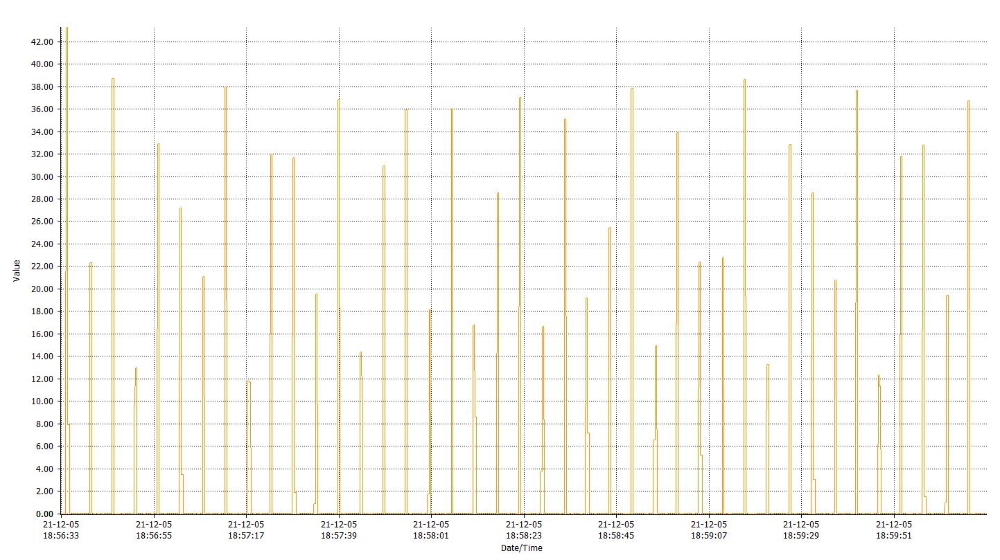

# First long run

|stats         | value               |
|--------------|---------------------|
| first boot   | 2021-10-29 17:14:54 |
| last refresh | 2021-11-08 05:39:40 |
|              |includes +1 hour due to DST|
| seq          | 131014              |
| refresh      | 859                 |
| bat          | 2998 mv             |

bat 2954 mV at 2021-11-08 11:30 ... something's draining current even when shut down

ran for 739486 seconds = 8.5 days

3.2 => 3 V took a few hours only (didn't see the 3.2 V warning display)
battery rated for 2.6Ah (9.62Wh)

=> ~12.6 mA average consumption which is x1000 more than deep sleep target (~10µA)

Assumptions without proper multi-meter measurments
* deep sleep is not measurable probably < 1 mA lets assume ~0.5mA
* each wake up takes 2s at 40mA
* each refresh takes 15s at 50mA
* each screen clear takes 30s at 50mA

* 2s wake-up is 91% of energy budget, deep sleep is 3% of energy budget
* 1s wake-up is 83% of energy budget, deep sleep is 6% of energy budget
* 0.5s wake-up is 72% of energy budget, deep sleep is 10% of energy budget

1.5s wake-up => ~2.5 Ah

First priority: save on wake-up time/energy consumption
- 40 mA is inline with measurements at https://diyi0t.com/reduce-the-esp32-power-consumption/
- Adjust CPU frequency to 80 MHz? (defaults to 240 MHz)
- Use ULP to probe temperature? https://www.youtube.com/watch?v=-QIcUTBB7Ww https://github.com/fhng/ESP32-ULP-1-Wire https://github.com/duff2013/ulptool https://github.com/espressif/arduino-esp32/issues/1491 https://github.com/platformio/platform-espressif32/issues/95 

Other TODOs:
- Use ESP-IDF logging facilities https://thingpulse.com/esp32-logging/
- Use PROGMEM https://www.e-tinkers.com/2020/05/do-you-know-arduino-progmem-demystified/

# Current measurement first soldered prototype Nov 30 2021

https://wiki.dfrobot.com/FireBeetle_Board_ESP32_E_SKU_DFR0654 see "Low Power Pad"

Measurements with UT61E+

Powered at 4V on VCC

Typical powered consumption: ~ 45 mA

With Low Power Pad not cut: ~ 490 µA

With Low Power Pad cut: ~ 71 µA / Sometimes ~125 µA ?!? / and the following day ~39 µA ?!?!?

With setup calling pinMode(2, OUTPUT or 0) and going directly to sleep and all components connected ~ 66 µA

With setup directly going to deep sleep and all components connected ~ 27 µA in deep sleep

With setup directly going to deep sleep and all components connected except DS18B20-PAR's data ping ~ 25 µA deep sleep

Board with no connections other than VCC & GND consumes ~ 14 µA in deep sleep

# Current measurement impact of light sleep during DS18B20 temp measurment

Measurements with UT61E+. The sampling and value refresh rates are a bit slow (a few 100 ms each). Values are in mA.

Wifi was disabled.

DS18B20 temperature measurement last ~750ms

DS18B20 with normal delay during measurement:

DS18B20 with light sleep during measurement:

BMP390L during measurement (no display):
