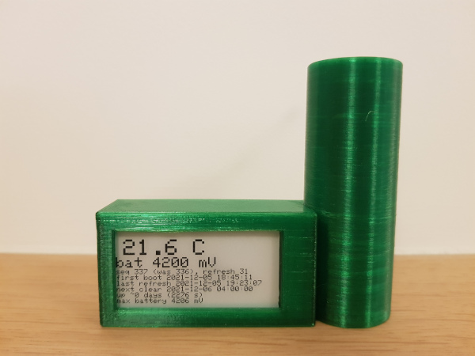

# First complete prototype

- Firebeetle ESP32-E
- Display:
  - DESPI-C02
  - GDEW0213M21
- Sensor:
  - DS18B20-PAR
  - 4.7 kOhm resistance
- Battery:
  - RS Pro 18650 26H Li-ion Battery Pack (2.6 Ah)

| ESP32 | DESPI-C02 |
|-------|-----------|
| 3.3V  | 3.3V      |
| GND   | GND       |
| MOSI  | SDI       |
| SCK   | SCK       |
| 0/D5  | CS        |
| 2/D9  | D/C       |
| 25/D2 | RES       |
| 26/D3 | BUSY      |

| ESP32 |          | DS18B20-PAR                          |
|-------|----------|--------------------------------------|
| 4/D12 |          | DQ (middle pin)                      |
| 3.3V  | 4.7 kOhm | DQ (middle pin)                      |
| GND   |          | GND (left when looking at flat face) |

# BMP390L minimal setup

- Firebeetle ESP32-E
- Sensor:
  - Fermion: BMP390L Digital Barometric Pressure Sensor (Breakout)

| ESP32 | BPM390L breakout board |
|-------|------------------------|
| 3V3   | 3V3                    |
| GND   | GND                    |
| SCL   | SCL                    |
| SDA   | SDA                    |