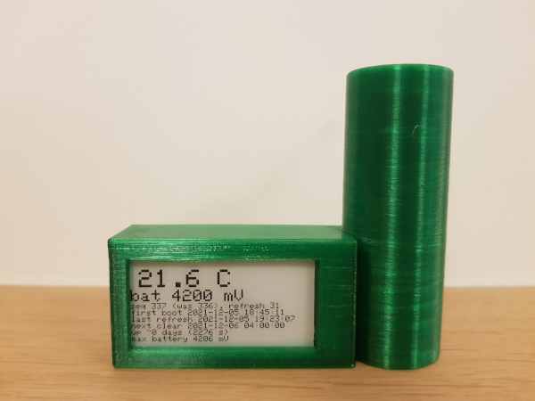

# First complete prototype

- Firebeetle ESP32-E
- Display:
  - DESPI-C02
  - GDEW0213M21
- Sensor:
  - DS18B20-PAR
  - 4.7 kOhm resistance
- Battery:
  - RS Pro 18650 26H Li-ion Battery Pack (2.6 Ah)

| ESP32 | DESPI-C02 |
|-------|-----------|
| 3.3V  | 3.3V      |
| GND   | GND       |
| MOSI  | SDI       |
| SCK   | SCK       |
| 14/D6 | CS        |
| 2/D9  | D/C       |
| 25/D2 | RES       |
| 26/D3 | BUSY      |

| ESP32 |          | DS18B20-PAR                          |
|-------|----------|--------------------------------------|
| 4/D12 |          | DQ (middle pin)                      |
| 3.3V  | 4.7 kOhm | DQ (middle pin)                      |
| GND   |          | GND (left when looking at flat face) |



# BMP390L + ePaper setup (ULP-capable)

- Firebeetle ESP32-E
- Sensor:
  - Fermion: BMP390L Digital Barometric Pressure Sensor (Breakout, SEN0423)
- Display:
  - DESPI-C02 + GDEW0213M21 (or 1.54" Z90c tricolor)

BMP390L is wired to GPIO0/GPIO4 (RTC I2C pins) so the ULP coprocessor
can read the sensor during deep sleep.

| ESP32   | BMP390L breakout |
|---------|------------------|
| 3V3     | 3V3              |
| GND     | GND              |
| 0/D5    | SDA              |
| 4/D12   | SCL              |

# BMP58x (BMP581/BMP585) + ePaper setup (ULP-capable)

Drop-in replacement for BMP390L — same pins, same wiring. Only the I2C address
differs (0x47 vs 0x77), so both sensors can coexist on the same bus.

- Sensor:
  - Fermion: BMP581 Digital Barometric Pressure Sensor (SEN0667), or
  - Fermion: BMP585 Digital Barometric Pressure Sensor (SEN0666)

| ESP32   | BMP58x breakout |
|---------|-----------------|
| 3V3     | VCC             |
| GND     | GND             |
| 0/D5    | SDA             |
| 4/D12   | SCL             |

Set `#define USE_BMP58x` in `local-secrets.h`. For LP core on C6, also change
`lp_core_main.c` to `#define LP_CORE_BMP58X` (LP core build doesn't inherit
main project defines).

## DESPI-C02 power gate (FDN340P)

The DESPI-C02 adapter board draws ~534 µA quiescent due to its boost converter.
A P-channel MOSFET on the 3.3V line cuts power during deep sleep.

```
3.3V ──────┬──────── FDN340P Source (pin 2)
           │
          10kΩ
           │
13/D7 ─────┴──────── FDN340P Gate (pin 1)

DESPI-C02 3.3V ───── FDN340P Drain (pin 3)
DESPI-C02 GND ────── GND (direct)
```

GPIO LOW → display powered on. GPIO HIGH / high-Z (deep sleep) → display off.

# Xiao Seed ESP32C6 + BMPxxx

- Xiao Seed ESP32C6
- Sensor:
  - Fermion BMP581
- Display + DESPI-CO2 + FDN340P
- Battery JST-2 PH-2P connectors on BAT - / +
- Current measurement - https://wiki.seeedstudio.com/xiao_esp32c6_getting_started/#reading-battery-voltage

## Sensor
| Xiao ESP32C6      | BMP581 breakout |
|-------------------|-----------------|
| 3V3               | VCC             |
| GND               | GND             |
| LP I2C SDA (MTCK) | SDA             |
| LP I2C SCL (MTDO) | SCL             |

## Battery voltage divider (GPIO-switched)

Seeed documents a 200kΩ/200kΩ (or 220kΩ) always-on divider, but that draws
~10µA continuously — almost doubles the deep sleep floor. A GPIO-switched
divider with an N-channel MOSFET eliminates quiescent draw entirely.

**Components:** 2× 100kΩ resistors + AO3400A (N-channel MOSFET, SOT-23)

```
Bat+ ─── 100kΩ ─── A0 (D0) ─── 100kΩ ─── AO3400A Drain
                                                │
                                             Source ─── GND
                                                │
                                        Gate ←── D1 (GP1)
```

- D1 HIGH → MOSFET on, divider active, A0 reads Vbat/2
- D1 LOW / deep sleep → MOSFET off, zero divider current
- R_source = 50kΩ → ADC settles in ~2µs, minimal averaging needed
- When MOSFET off, A0 floats toward Vbat through 100kΩ; leakage through
  the ADC's ESD clamp is ~(4.2−3.9V)/100kΩ ≈ 3µA — but only through the
  internal protection diode, negligible in practice

**Read sequence:** set D1 HIGH, delayMicroseconds(100), analogRead(A0) a
few times for noise averaging, set D1 LOW. Total on-time <1ms.

**Why 100kΩ, not 1MΩ:** with 1MΩ/1MΩ (R_source = 500kΩ), the ESP32 SAR
ADC sample window (~300ns) is far too short for the RC to settle — readings
are biased low, not just noisy, and averaging doesn't fix bias. 100kΩ/100kΩ
settles in ~2µs which is still longer than the sample window but close enough
that a few back-to-back reads converge. Adding a 100nF buffer cap at A0 would
allow higher resistance values (charges in 5×R_source×100nF) but adds a
component for no real benefit when the divider is switched off during sleep.

## Display

D9 (GPIO20) is also SPI MISO — SPI.begin() must be called with MISO=-1 before
GxEPD2 init to avoid the SPI peripheral stealing the D/C pin (e-paper is
write-only so MISO is not needed). Similarly D3 (GPIO21) is SPI SS; passing
SS=-1 prevents it claiming the BUSY pin.

| Xiao ESP32C6   | DESPI-C02 |
|-----------------|-----------|
| 3.3V            | 3.3V      |
| GND             | GND       |
| MOSI/D10 (GP18) | SDI       |
| SCK/D8 (GP19)   | SCK       |
| D6 (GP16)       | CS        |
| D9 (GP20)       | D/C       |
| D2 (GP2)        | RES       |
| D3 (GP21)       | BUSY      |

D7 (GP17) for the MOSFET Gate

## Unused pins

Breakout:
VBUS
D4
D5

Under board:
MTDI
GND
EN
MTMS
3V3
BOOT
