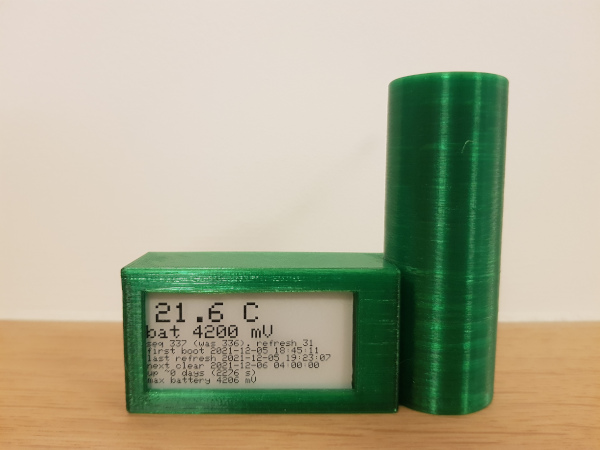
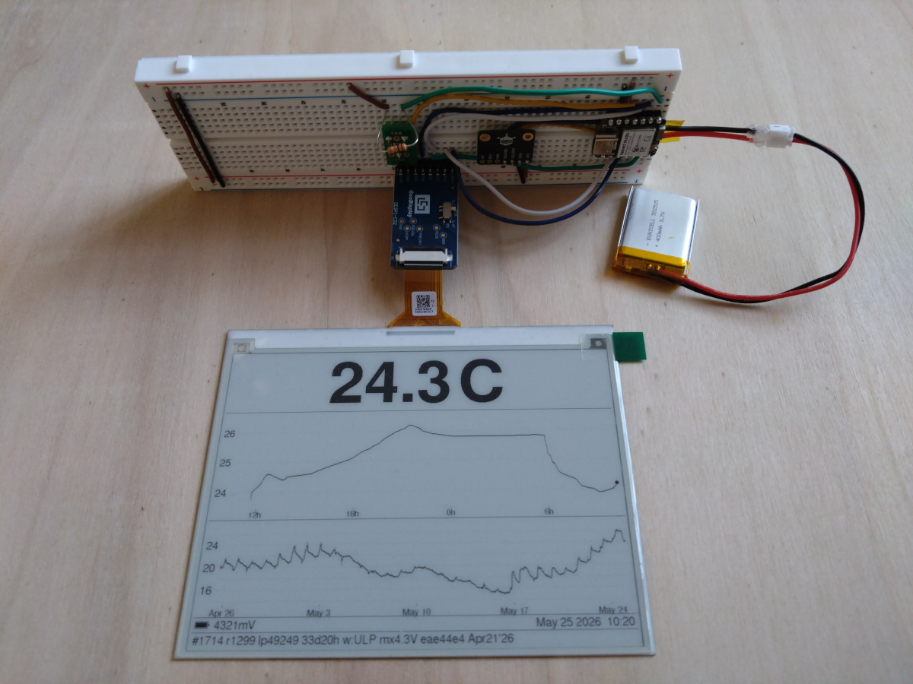

# First complete prototype

- Firebeetle ESP32-E
- Display:
  - DESPI-C02
  - GDEW0213M21
- Sensor:
  - DS18B20-PAR
  - 4.7 kOhm resistance
- Battery:
  - RS Pro 18650 26H Li-ion Battery Pack (2.6 Ah)

| ESP32 | DESPI-C02 |
|-------|-----------|
| 3.3V  | 3.3V      |
| GND   | GND       |
| MOSI  | SDI       |
| SCK   | SCK       |
| 14/D6 | CS        |
| 2/D9  | D/C       |
| 25/D2 | RES       |
| 26/D3 | BUSY      |

| ESP32 |          | DS18B20-PAR                          |
|-------|----------|--------------------------------------|
| 4/D12 |          | DQ (middle pin)                      |
| 3.3V  | 4.7 kOhm | DQ (middle pin)                      |
| GND   |          | GND (left when looking at flat face) |



# BMP390L + ePaper setup (ULP-capable)

- Firebeetle ESP32-E
- Sensor:
  - Fermion: BMP390L Digital Barometric Pressure Sensor (Breakout, SEN0423)
- Display:
  - DESPI-C02 + GDEW0213M21 (or 1.54" Z90c tricolor)

BMP390L is wired to GPIO0/GPIO4 (RTC I2C pins) so the ULP coprocessor
can read the sensor during deep sleep.

| ESP32   | BMP390L breakout |
|---------|------------------|
| 3V3     | 3V3              |
| GND     | GND              |
| 0/D5    | SDA              |
| 4/D12   | SCL              |

# BMP58x (BMP581/BMP585) + ePaper setup (ULP-capable)

Drop-in replacement for BMP390L — same pins, same wiring. Only the I2C address
differs (0x47 vs 0x77), so both sensors can coexist on the same bus.

- Sensor:
  - Fermion: BMP581 Digital Barometric Pressure Sensor (SEN0667), or
  - Fermion: BMP585 Digital Barometric Pressure Sensor (SEN0666)

| ESP32   | BMP58x breakout |
|---------|-----------------|
| 3V3     | VCC             |
| GND     | GND             |
| 0/D5    | SDA             |
| 4/D12   | SCL             |

Set `#define USE_BMP58x` in the rig header (`include/rigs/<name>.h`). The LP
core derives `LP_CORE_BMP58X` from the same selector, so there is no second
place to change.

## DESPI-C02 power gate (FDN340P)

The DESPI-C02 adapter board draws ~534 µA quiescent due to its boost converter.
A P-channel MOSFET on the 3.3V line cuts power during deep sleep.

```
3.3V ──────┬──────── FDN340P Source (pin 2)
           │
          10kΩ
           │
13/D7 ─────┴──────── FDN340P Gate (pin 1)

DESPI-C02 3.3V ───── FDN340P Drain (pin 3)
DESPI-C02 GND ────── GND (direct)
```

GPIO LOW → display powered on. GPIO HIGH / high-Z (deep sleep) → display off.

# Xiao Seed ESP32C6 + BMPxxx

- Xiao Seed ESP32C6
- Sensor:
  - Fermion BMP581
- Display + DESPI-CO2 + FDN340P
- Battery JST-2 PH-2P connectors on BAT - / +
- Current measurement - https://wiki.seeedstudio.com/xiao_esp32c6_getting_started/#reading-battery-voltage

## Sensor

| Xiao ESP32C6      | BMP581 breakout |
|-------------------|-----------------|
| 3V3               | VCC             |
| GND               | GND             |
| LP I2C SDA (MTCK) | SDA             |
| LP I2C SCL (MTDO) | SCL             |

## Display

D9 (GPIO20) is also SPI MISO — SPI.begin() must be called with MISO=-1 before
GxEPD2 init to avoid the SPI peripheral stealing the D/C pin (e-paper is
write-only so MISO is not needed). Similarly D3 (GPIO21) is SPI SS; passing
SS=-1 prevents it claiming the BUSY pin.

| Xiao ESP32C6   | DESPI-C02 |
|-----------------|-----------|
| 3.3V            | 3.3V      |
| GND             | GND       |
| MOSI/D10 (GP18) | SDI       |
| SCK/D8 (GP19)   | SCK       |
| D6 (GP16)       | CS        |
| D9 (GP20)       | D/C       |
| D2 (GP2)        | RES       |
| D3 (GP21)       | BUSY      |

D7 (GP17) for the MOSFET Gate

## Battery voltage divider (GPIO-switched)

Seeed documents a 200kΩ/200kΩ (or 220kΩ) always-on divider, but that draws
~10µA continuously — almost doubles the deep sleep floor. A GPIO-switched
divider with an N-channel MOSFET eliminates quiescent draw entirely.

**Components:** 2× 100kΩ resistors + AO3400A (N-channel MOSFET, SOT-23)

```
Bat+ ─── 100kΩ ─── A0 (D0) ─── 100kΩ ─── AO3400A Drain
                                                │
                                             Source ─── GND
                                                │
                                        Gate ←── D1 (GP1)
```

- D1 HIGH → MOSFET on, divider active, A0 reads Vbat/2
- D1 LOW / deep sleep → MOSFET off, zero divider current
- R_source = 50kΩ → ADC settles in ~2µs, minimal averaging needed
- When MOSFET off, A0 floats toward Vbat through 100kΩ; leakage through
  the ADC's ESD clamp is ~(4.2−3.9V)/100kΩ ≈ 3µA — but only through the
  internal protection diode, negligible in practice

**Read sequence:** set D1 HIGH, delayMicroseconds(100), analogRead(A0) a
few times for noise averaging, set D1 LOW. Total on-time <1ms.

**Why 100kΩ, not 1MΩ:** with 1MΩ/1MΩ (R_source = 500kΩ), the ESP32 SAR
ADC sample window (~300ns) is far too short for the RC to settle — readings
are biased low, not just noisy, and averaging doesn't fix bias. 100kΩ/100kΩ
settles in ~2µs which is still longer than the sample window but close enough
that a few back-to-back reads converge. Adding a 100nF buffer cap at A0 would
allow higher resistance values (charges in 5×R_source×100nF) but adds a
component for no real benefit when the divider is switched off during sleep.

## Unused pins

Breakout:
VBUS
D4
D5

Under board:
MTDI
GND
EN
MTMS
3V3
BOOT



# Seeed ePaper Driver Board for XIAO vs DESPI-C02 (compatibility notes)

Researched 2026-07-04. The Seeed board
([wiki](https://wiki.seeedstudio.com/xiao_eink_expansion_board_v2/), schematic in
`hardware/Seeed ePaper Driver Board for XIAO SCH v1.0.pdf`) is a faithful copy of
Good Display's reference booster, so Good Display panels are what it's implicitly
built for (Seeed's own panels are rebranded GD units).

**Identical to DESPI-C02:** 24-pin 0.5mm FPC with the standard Good Display
pinout, 3.3V logic/supply, same boost circuit down to the recommended parts
(10µH inductor, Si1304BDL MOSFET, MBR0530-class Schottkys — B0540WS on the
Seeed board, 4.7µF/50V boost cap).

**The one real difference — RESE:** DESPI-C02 has a 0.47Ω/3Ω select switch;
the Seeed board has a **fixed 0.47Ω** (R2, no alternate footprint). Good
Display warns a wrong RESE "will cause the e-paper cannot be refreshed"
(in practice a 3Ω panel on 0.47Ω often still refreshes, but with a stressed
booster / degraded image — out of spec). Per the DESPI-C02 spec
(`hardware/DESPI-C02 Connector Board for E-paper Display V1.1.pdf`):

- **0.47Ω (fine on Seeed board):** GDEW/GDEY series (UC81xx-driven), most
  newer panels, four-color panels — e.g. GDEW042T2, GDEW075T7
- **3Ω (mismatched on Seeed board):** mostly older GDEH/GDEM SSD16xx panels —
  GDEH0154D67, GDEH0213B73, GDEH029A1 — plus oddballs GDEW0583T7, GDEW075T8

Naming is not a reliable guide (two GDEW panels need 3Ω) — check the
panel datasheet's peripheral/reference circuit page for the RESE value
before plugging in. GDEH0154Z90 (our tricolor 1.54") is in the GDEH/SSD1681
family, so likely the 3Ω group — verify before using it on the Seeed board.

**Extras on the Seeed board (not compatibility-relevant):** ETA9740 battery
charger (0.5A) + JST-PH battery connector + power switch.

**Fixed pin mapping** (firmware must match; DESPI-C02 wiring is free-form):

| Signal | XIAO pin |
|--------|----------|
| RST    | D0       |
| CS     | D1       |
| BUSY   | D2       |
| DC     | D3       |
| SCK    | D8       |
| MOSI   | D10      |

Note this conflicts with our C6 battery-divider use of D0/D1 below. With this
board plugged in plus LP I2C on D4/D5, no ADC-capable pin (A0–A5 = GPIO0–5)
remains free for a battery divider.

## To verify before/when trying the Seeed board (2026-07-04)

- [x] RESE for each Good Display panel we'd use: check the datasheet's
      peripheral circuit page. GDEH0154Z90 is likely the 3Ω group (SSD1681);
      board is fixed 0.47Ω. If mismatched, test whether refresh quality is
      acceptable anyway.
      → GDEW029I6FD (0.47Ω family) verified working 2026-07-05, first flash.
      GDEH0576T81 datasheet wants RESE 2.2Ω + 47µH inductor — out of spec on
      this board (0.47Ω + 10µH), untested.
- [x] Battery via the board's JST (ETA9740 path): PPK2 the sleep floor —
      boost-IC quiescent + double conversion (BAT→5V boost→XIAO LDO→3V3) may
      dominate our ~16µA C6 floor.
      → Measured 2026-07-05: ~499µA floor (load-detect pulses every ~2s),
      refresh 17.13mC vs 12.21mC at the rail (~75-80% conversion efficiency).
      RULED OUT for deployment — go battery-direct on XIAO BAT pads. notes.md.
- [x] Battery direct on XIAO BAT pads instead: measure ETA9740 leakage with
      its JST empty + switch off; if significant, leave the 5V header pin
      unconnected between XIAO and shield (ETA9740 OUT ties to 5V rail).
      → Measured 2026-07-05: no observable leakage — 22µA @ 4.2V floor
      matches the rail baseline through the XIAO's SGM6029C buck (~90%
      efficient). THIS IS THE DEPLOYMENT CONFIG, but usable only down to
      ~3.6-3.7V: the 3V3 rail is a pure buck, so at VBAT ≤3.5V it enters
      dropout pathology (30Hz/480µA bootstrap sawtooth at 3.3V, rail-sag +
      0.88A burst storms at 3.5V). Needs real VBAT sensing + ~3.5V shutdown
      in firmware (C6 battery read is still stubbed). See notes.md sweep.
- [x] Panel/booster quiescent: board has no power gate (3V3 hardwired to
      booster/FPC). Check for DESPI-C02-style ~500µA draw; fix would be
      interposing the FDN340P on the single 3V3 pin (bent pin or cut trace).
      → Measured 2026-07-05 (I6FD): floor ~25.1µA vs 15.8µA gated-DESPI
      baseline = +~9.3µA ungated standby. No ~500µA problem; gate mod
      probably not worth it. See notes.md.
- [x] If battery monitoring is needed with this board: check whether any
      underside pads (MTDI/MTMS) are ADC-capable — D0/D1 are taken by RST/CS.
      → YES: C6 ADC1 = GPIO0-6, so MTMS = GPIO4 = ADC1_CH4 and MTDI =
      GPIO5 = ADC1_CH5, both free in the shield config (LP I2C is GPIO6/7).
      Plan: GPIO-switched 100k/100k divider (see above), sense on GPIO5
      (MTDI pad), AO3400A gate on D4 or D5 (free header pins). Firmware
      thresholds are board-split in Thermometer.cpp; the XIAO's are
      3800/3700 mV, finalised by the 2026-07-05 fine sweep — 3.7V is the
      lowest verified-healthy point and 3.6V is already inside the sag band.
- [x] Reliable 3-way power comparison, same screen setup (C6 + BMP581 +
      Seeed board + GDEW029I6FD, release build) across all three power
      configs: (1) PPK2 3.3V into the 3V3 rail (done 2026-07-05, ~25.1µA /
      12.21mC = 40.3mJ), (2) PPK2 as battery at the shield JST — ETA9740
      boost + XIAO buck double conversion (done: ~327-500µA floor, ruled
      out), (3) PPK2 as battery on the XIAO BAT pads, JST empty, switch off
      (done: 22µA @ 4.2V, winner — see BAT-pads voltage sweep in notes.md).
      Record source voltage with every figure and compare in mJ, not mC —
      different node voltages. COMPLETE 2026-07-05.
- [ ] Buck-cliff follow-ups (voltage map itself is complete, notes.md):
      (a) overnight soak at 3.70V with hourly refreshes — storm statistics
      behind the 3700mV shutdown rest on one clean minute so far;
      (b) cold test ~0°C at 3.6/3.7V — the sag edge is a VTH effect and
      VTH rises when cold, so the 3.545V edge likely shifts UP in winter;
      (c) one refresh on the real cell at ~3.75V OCV — battery ESR +
      protection-PCB drop make effective VIN lower than the stiff PPK2.
- [ ] Confirm the power switch (CN6) is in series between the battery JST and
      the ETA9740 BAT pin: continuity check across JST+ and the IC side in
      both switch positions (schematic doesn't label common vs throws).
      Note: switch off does NOT isolate the ETA9740 from VDD_5V — its OUT pin
      is hardwired to the XIAO 5V pin, so the IC powers up whenever USB is
      plugged in, regardless of switch position.

